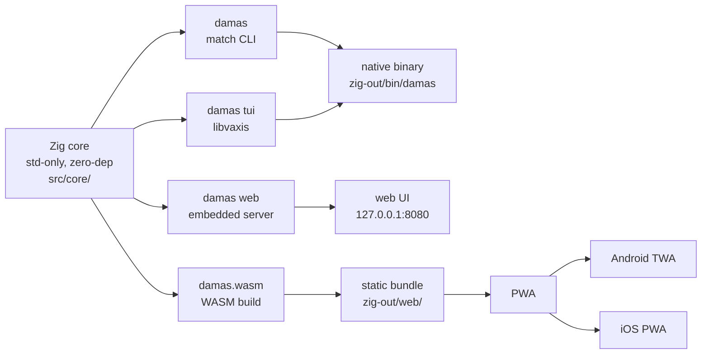

# 01 — Overview

## What

`damas` is a checkers engine and app family written in Zig 0.16. One shared,
zero-dependency core (std-only) is deployed through four entry points: a
config-driven match CLI, a terminal UI, a web server with an embedded
frontend, and a standalone WASM bundle that can become a PWA. Two rule
variants are supported: **English draughts** (default) and **Spanish damas**.
An LLM can play as a player through an OpenAI-compatible chat endpoint.

## Why

The project is didactic by design. The point is to show one core deployed in
several environments:

- a native CLI (match against the engine or an LLM),
- a full-screen TUI built on libvaxis,
- a web UI served by the binary itself,
- the same web UI as a static WASM bundle, installable as a PWA on Android
  (TWA) and iOS.

This proves a practical claim: if you keep the core pure and dependency-free,
every entry point stays thin. The same `src/runtime/protocol.zig` module, for
example, serves both the WebSocket server and the WASM build.

## How

One core, four entry points, one set of artifacts:



### Entry points

The binary dispatches on the first non-flag argument. The usage text
(`src/damas.zig:12-22`) lists them:

| Command | What it does |
|---------|--------------|
| `damas` | Config-driven match from `config.json` (players: `human`, `minimax`, `llm`) |
| `damas web` | Web UI + WebSocket server on `http://127.0.0.1:8080`, opens the browser |
| `damas tui` | Full-screen terminal UI |
| `damas help` / `damas --version` | Usage text / version stamp |

Dispatch is in `src/damas.zig:76-84`: `web`, `tui`, and `help` are matched by
name; a missing subcommand falls back to the match CLI (`src/damas.zig:84`).
`--version` prints `build_options.version` (`src/damas.zig:61-64`).

### `--rules english|spanish`

The rule variant is configurable on any entry point:

- `damas --rules spanish`
- `damas tui --rules spanish`
- `damas web --rules spanish` (becomes the server's default for new games)

Parsing is strict: anything other than `english`/`spanish` is an error
(`src/damas.zig:40-51`, `src/damas.zig:93-97`). The flag beats `config.json`:
the match CLI resolves the variant as `rules_flag orelse cfg.rules`
(`src/runtime/cli.zig:44`). In web mode the flag becomes the server's default
variant (`src/damas.zig:99-104`).

### Two rule variants

The rules module documents both variants in its header
(`src/core/rules.zig:1-21`):

- **English draughts** — captures are mandatory; if any exist, only capture
  moves are generated. Pawns move and capture forward only. Kings are
  non-flying: one square per step in any of the four diagonal directions.
- **Spanish damas** — pawns capture forward only. Kings are **flying**: they
  slide any distance along a diagonal. Captures are mandatory and the Spanish
  capture laws apply: keep the chains capturing the most pieces (ley de la
  cantidad), and among those the ones capturing the most kings (ley de la
  calidad).

The default variant is **Spanish at every layer**: the config parser falls
back to Spanish when `"rules"` is missing or unknown
(`src/utils/config.zig:57-63`), `Game.init` defaults to Spanish
(`src/core/game.zig:30-33`), and the web server defaults to Spanish without
`--rules` (`src/damas.zig:104`). English only via an explicit
`"rules": "english"`, `--rules english`, or the UI selector. The WASM ABI is
the exception: `dz_init` treats anything other than 1 as English
(`src/wasm_api.zig:48`).

## Try it

```sh
zig build                    # native binary → zig-out/bin/damas
zig-out/bin/damas --version  # version stamp
zig-out/bin/damas help       # usage text
zig-out/bin/damas            # config-driven match (needs config.json in cwd)
zig-out/bin/damas --rules spanish   # Spanish rules, match CLI
zig-out/bin/damas tui --rules spanish  # TUI with Spanish rules
zig-out/bin/damas web        # web UI on http://127.0.0.1:8080
zig build web                # WASM bundle → zig-out/web/
```

Requires Zig **0.16.0 release** — dev builds don't compile libvaxis
(`README.md:28-29`).

## Further reading

- [02-architecture](02-architecture.md) — how the four entry points share the core
- [03-engine](03-engine.md) — move generation and search internals
- [04-llm-integration](04-llm-integration.md) — the LLM player
- [06-web-server](06-web-server.md) — the embedded server
- [07-web-wasm](07-web-wasm.md) — the WASM build
