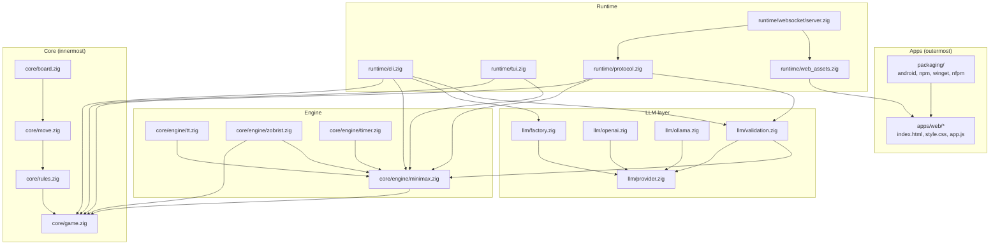
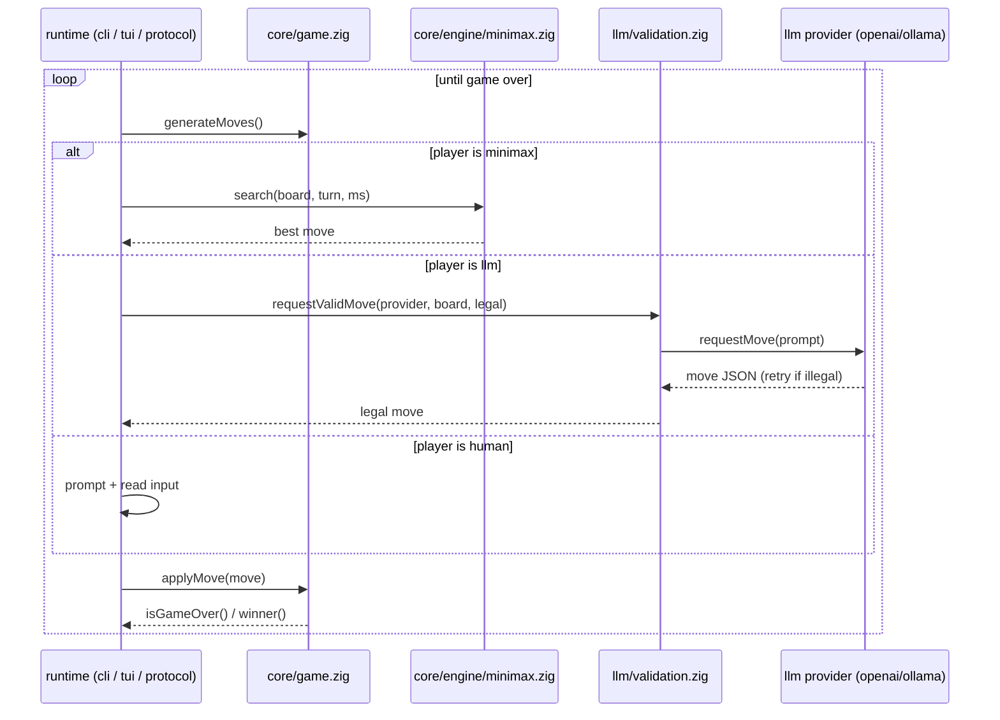

# 02 — Architecture

## What

`damas` is a layered Zig program. A pure, dependency-free core implements
board, moves, rules, and game state. An engine layer adds search. An LLM layer
turns a chat endpoint into a player. A runtime layer adapts the core to each
frontend: CLI, TUI, WebSocket server, WASM. Apps on top are the web frontend
and the packaging targets.

## Why

The architecture answers one question: how do four entry points share one
engine without duplicating it? The answer is a strict direction of
dependencies — inner layers never import outer ones — plus two tricks that
keep the runtime thin:

1. **One binary, assets embedded.** `damas web` serves the frontend files
   compiled into the executable via `@embedFile`, so there is nothing to
   install alongside the binary.
2. **A pure game protocol.** All game logic that runs over a socket also runs
   in the browser (WASM). The protocol module has no sockets, no HTTP, no
   provider factory — the transport injects what it needs.

## How

### Layers



### Module map

Rough sizes (lines of code, `wc -l`) and one-line responsibilities.

| Module | LOC | Responsibility |
|--------|-----|----------------|
| `src/core/board.zig` | 167 | Board representation (32 playable squares) and rendering |
| `src/core/move.zig` | 69 | Move representation and fixed-capacity move list |
| `src/core/rules.zig` | 739 | Move generation, application, legality; both rule variants |
| `src/core/game.zig` | 330 | Game state, turn, repetition/halfmove draw rules |
| `src/core/engine/minimax.zig` | 293 | Negamax alpha-beta search with iterative deepening |
| `src/core/engine/tt.zig` | 107 | Transposition table (overwrite replacement) |
| `src/core/engine/zobrist.zig` | 74 | Zobrist hashing for positions |
| `src/core/engine/timer.zig` | 76 | Search time limit |
| `src/llm/provider.zig` | 90 | Vtable-based LLM provider interface + prompt builder |
| `src/llm/openai.zig` | 96 | OpenAI-compatible chat provider (also Groq) |
| `src/llm/ollama.zig` | 77 | Local Ollama provider, no auth |
| `src/llm/factory.zig` | 72 | Provider construction from config / env auto-detect |
| `src/llm/validation.zig` | 55 | Retry loop until the LLM picks a legal move |
| `src/runtime/cli.zig` | 188 | Config-driven match CLI |
| `src/runtime/tui.zig` | 692 | Full-screen terminal UI (libvaxis) |
| `src/runtime/protocol.zig` | 211 | Pure WebSocket game protocol, transport-agnostic |
| `src/runtime/web_assets.zig` | 36 | Embedded frontend assets |
| `src/runtime/websocket/server.zig` | 235 | WebSocket server: bytes between socket and protocol |
| `src/wasm_api.zig` | 119 | WASM ABI over the same protocol |
| `src/utils/config.zig` | 153 | JSON config loading + env API keys |
| `src/utils/http.zig` | 197 | Minimal blocking HTTP JSON POST helper (timeout/retry story: [04-llm-integration](04-llm-integration.md)) |

## Design decisions

### 1. One binary, assets embedded

`damas web` serves `index.html`, `style.css`, and `app.js` compiled into the
executable. The embeds live inside a function, deliberately:

```zig
.content = @embedFile("../../apps/web/index.html"),
```
(`src/runtime/web_assets.zig:22-32`, one embed per asset).

`@embedFile` resolves relative to the file that calls it, and it must stay
within the module's package path. That forces the exe module to be rooted at
the **repo root**, not `src/`. The comment in `src/runtime/web_assets.zig:1-9`
explains:
the `ws_tests` module is rooted at `src/`, where the same path would be
"outside package path" — but function bodies are analyzed lazily, and the
tests never call `get`, so the embeds are never compiled there
(`src/runtime/web_assets.zig:1-9`).

The module root is `damas_root.zig`, which is just a forwarding main:

```zig
//! Build anchor for damas. The module root must be the repo root (not src/)
//! so that @embedFile("../../apps/web/*") inside src/runtime/web_assets.zig
//! resolves within the package path ...
```
(`damas_root.zig:1-5`; the forwarding main is at `damas_root.zig:9-11`).
`build.zig:21-24` repeats the constraint when wiring the exe module.

### 2. Pure protocol, reused by server and WASM

`src/runtime/protocol.zig` implements the whole game protocol — `new_game`,
`make_move`, `compute_minimax`, `request_llm` — with no I/O. Its header says
it outright:

```zig
//! No sockets, no HTTP, no provider factory: the transport layer feeds
//! `handleMessage` and injects the LLM provider constructor via
//! `ConnState.build_provider`, so this module is reusable from WASM.
```
(`src/runtime/protocol.zig:1-6`)

`ConnState` carries the injected hook (`src/runtime/protocol.zig:19-31`,
`build_provider` at line 30). Two transports consume the module:

- The WebSocket server injects a factory-backed builder: `serveGame` builds
  `protocol.ConnState{ .build_provider = defaultProvider }`
  (`src/runtime/websocket/server.zig:207-211`, builder at line 24).
- The WASM build imports the same module (`src/wasm_api.zig:10`) and leaves
  `build_provider` null, so `request_llm` answers "LLM provider unavailable"
  (`src/wasm_api.zig:5-6`, `src/wasm_api.zig:35`).

### 3. Testability

`zig build test` runs **six** suites (`build.zig:67-137`): core, llm, ws,
server, wasm_api, tui. The LLM and WS suites run without a network: they
exercise code paths with fake providers.

- `src/llm_tests.zig:1-4` — "No network: providers are compile-checked and
  exercised via fake vtables and canned response bodies."
- `src/ws_tests.zig:1-4` — "No sockets: `handleMessage` is exercised directly
  with a fake LLM provider."

The WASM suite runs natively: `dz_handle` reads the slice directly on 64-bit
hosts (`src/wasm_api.zig:77-83`).

## Code tour

Follow one layer at a time, inner to outer.

- **Core.** Board layout and square indexing: `src/core/board.zig:1-11`. Move
  struct (extern, ABI-stable): `src/core/move.zig:1-10`. Rule variants and
  capture laws: `src/core/rules.zig:1-21`. Game lifecycle and draw rules:
  `src/core/game.zig:16-28` (state), `src/core/game.zig:60-77` (`applyMove`),
  `src/core/game.zig:82-93` (`isGameOver`).
- **Engine.** `minimax.search` is the public entry: `src/core/engine/minimax.zig:50`.
  Transposition table: `src/core/engine/tt.zig:1-5`. Zobrist hashing (comptime
  generated, deterministic): `src/core/engine/zobrist.zig:1-6`. Timer
  (independent of the Io event loop): `src/core/engine/timer.zig:1-6`.
- **LLM.** Interface + prompt builder: `src/llm/provider.zig:47` (`buildPrompt`).
  Construction and auto-detect: `src/llm/factory.zig:46` (`detectProvider`),
  `src/llm/factory.zig:58` (`fromConfig`). Providers:
  `src/llm/openai.zig:33` (`init`), `src/llm/ollama.zig:28` (`init`). Legal-move
  retry loop: `src/llm/validation.zig:18` (`requestValidMove`).
- **Runtime.** CLI player dispatch: `src/runtime/cli.zig:62-70` (human /
  minimax / llm per turn). Variant precedence: `src/runtime/cli.zig:44`. TUI:
  `src/runtime/tui.zig:1-7`. Embedded assets: `src/runtime/web_assets.zig:19`
  (`get`). Server: `src/runtime/websocket/server.zig:34` (`serve`),
  `src/runtime/websocket/server.zig:52` (`serveWeb`).
- **Apps.** Web frontend: `apps/web/*` (source of truth for the embedded
  assets). Packaging: `packaging/` (android, npm, winget, nfpm).

### Rule variant resolution order

The default rule variant is **Spanish at every layer** (see
[01-overview](01-overview.md)):

| Layer | Default when unspecified | Source |
|---|---|---|
| `config.json` (`"rules"`) | Spanish (missing/unknown value) | `src/utils/config.zig:57-63` |
| `Game.init` | Spanish | `src/core/game.zig:30-33` |
| `damas web` server (no `--rules`) | Spanish | `src/damas.zig:104` |
| WASM ABI (`dz_init`) | **English** unless `rules == 1` — the exception | `src/wasm_api.zig:48` |

### Match data flow

How a match moves between layers (game.zig is the organizer — it knows nothing
about transports; the runtime picks the player):



`Game.applyMove` validates through `rules.isLegalMove` and flips the turn
(`src/core/game.zig:60-77`); the runtime loop in the CLI is
`src/runtime/cli.zig:48-71`.

## Try it

```sh
zig build                # build the binary (exe module rooted at damas_root.zig)
zig build test           # six test suites: core, llm, ws, server, wasm_api, tui
zig build web            # WASM module + assets → zig-out/web/
zig-out/bin/damas --version
```

`zig build test` output shows the suite list; each `addTest` in
`build.zig:70-137` is one suite. All suites run only on the native target
(gated by `native`, `build.zig:18-19`) — cross-compiled binaries can't execute
on the build host.

## Further reading

- [01-overview](01-overview.md) — entry points and rule variants
- [03-engine](03-engine.md) — search internals
- [04-llm-integration](04-llm-integration.md) — the LLM layer
- [06-web-server](06-web-server.md) — the embedded server and protocol
- [07-web-wasm](07-web-wasm.md) — the WASM ABI
