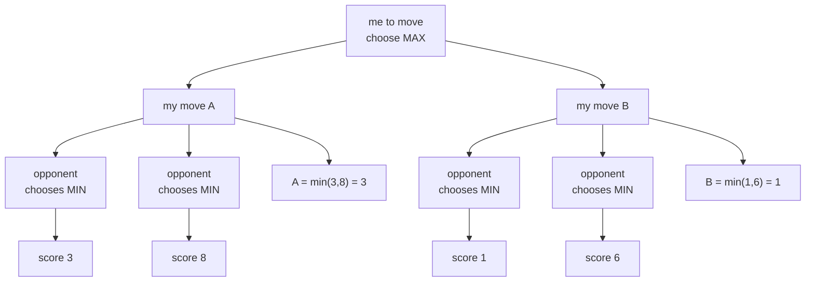
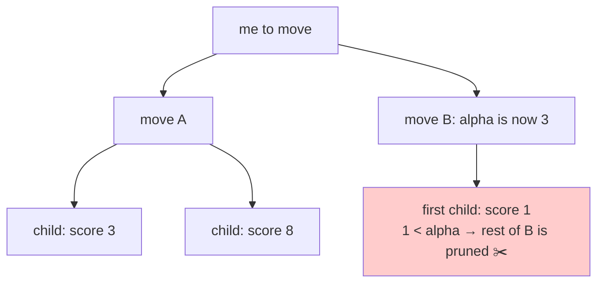

# 03 — Engine: how the search plays checkers

## What

`src/core/engine/` is the player that beats you when you pick `"type":
"minimax"`. It is a negamax search with alpha-beta pruning, iterative
deepening, a transposition table, MVV-LVA move ordering, and a time limit.
Given a board, a side to move, and a number of milliseconds, it returns the
best move found within the budget.

## Why

A checkers position has too many continuations to brute-force. You need
search to see ahead, and you need pruning, ordering, and memory tricks to see
deep enough in the time you have. The engine makes deliberate trade-offs —
documented in the code — to stay simple while playing decently.

The whole search lives in five small files:

| File | LOC | Job |
|------|-----|-----|
| `src/core/engine/minimax.zig` | 633 | The search itself: negamax + alpha-beta, iterative deepening, move ordering, evaluation |
| `src/core/engine/tt.zig` | 107 | Transposition table: remembers positions already searched |
| `src/core/engine/zobrist.zig` | 74 | Hashes a board to a `u64` key for the table |
| `src/core/engine/timer.zig` | 76 | Time limit that stops the search |
| `src/core/board.zig` | 167 | Board representation the search operates on |

## How

### Board representation

The board is an array of 32 bytes — one per playable square:

```zig
pub const Board32 = [32]Piece;
```
(`src/core/board.zig:20`)

Only the 32 dark squares of an 8x8 board are playable. A square `(row, col)`
is playable when `(row + col)` is even, and its index is `row * 4 + col / 2`
(`src/core/board.zig:3-10`). A `Piece` is one of five values: `empty`,
`white_pawn`, `white_king`, `black_pawn`, `black_king` (`src/core/board.zig:18`).

This representation is deliberately tiny. The search makes a **copy** of the
board, applies a move to the copy, and recurses — that is the undo mechanism:

```zig
var b2 = board;
rules.applyMove(&b2, m);
const score = -negamax(b2, board_mod.opponent(turn), depth - 1, -beta, -alpha, ply + 1, ctx);
```
(`src/core/engine/minimax.zig:151-153`)

32 bytes per copy is cheap enough that no move-undo bookkeeping is needed.
The header states the design outright: "Board copies (32 bytes) are used for
undo" (`src/core/engine/minimax.zig:4-6`).

The opening position — 12 white pawns on rows 0–2, 12 black pawns on rows
5–7 — comes from `initialBoard` (`src/core/board.zig:24-43`).

### Move generation and the two rule variants

The rules layer generates the legal moves for a position:
`rules.generateMoves` (`src/core/rules.zig:263`). Two details matter for the
engine:

- **Captures are mandatory.** If any capture exists, only capture moves are
  generated. This is what makes the tactical side of the game sharp.
- **Each `Move` is a complete chain.** A multi-jump is one move: start square,
  final landing square, and the captured squares in order
  (`src/core/rules.zig:5-6`). The engine reasons about one chain as one
  choice — it never re-searches the intermediate squares.

The variants differ in the capture rules (`src/core/rules.zig:4-21`):

- **English** — pawns move and capture forward only; kings are non-flying (one
  square per step in any direction).
- **Spanish** — pawns capture forward only; kings are **flying** (slide any
  distance). Among all capture chains, keep only those capturing the most
  pieces (ley de la cantidad), and among those the ones capturing the most
  kings (ley de la calidad). This filtering lives in `applyCaptureLaws`
  (`src/core/rules.zig:204`).

### The algorithm, from zero

#### Minimax, then negamax

Classic minimax: I want the move that maximizes my score, assuming my
opponent picks the move that minimizes it. Every level of the tree alternates
between "max" and "min":



I pick A (3) over B (1). Depth 2, done by hand. Depth 12 needs a computer.

**Negamax** is the same idea in one formula. From the side to move's
perspective, every node is a "max" node; the opponent's values are just
negated:

```zig
const score = -negamax(b2, child_turn, depth - 1, -beta, -alpha, ply + 1, new_clock, child_rep_base, ctx);
```
(`src/core/engine/minimax.zig:210`)

One evaluation function, alternating signs — no max/min switch per level
(`src/core/engine/minimax.zig:366-382`).

#### Alpha-beta pruning

Alpha-beta answers: "do I need to see all children?" No. Once I know move A
scores 3, if the first child of move B scores 1, B can never beat 3 — the
rest of B's children don't matter.

- `alpha` — the best score the side to move has secured so far (a floor).
- `beta` — the score the opponent can force (a ceiling).

If `alpha >= beta`, the node can't influence the result; cut the branch:

```zig
if (score > alpha) alpha = score;
if (alpha >= beta) break;
```
(`src/core/engine/minimax.zig:159-160`)

The cut is exact — the same move is chosen as without pruning, just faster.
The bound passes down through the recursion as `(-beta, -alpha)`
(`src/core/engine/minimax.zig:153`):



#### Iterative deepening

Search depth 1 first, then 2, then 3…, keeping the deepest completed result:

```zig
var depth: u8 = 1;
while (depth <= MAX_DEPTH) : (depth += 1) {
    ctx.aborted = false;
    ctx.nodes = 0;
    const score = rootSearch(board, turn, depth, &ctx);
    if (ctx.aborted) break;
    best = ctx.root_best;
    ...
}
```
(`src/core/engine/minimax.zig:66-74`)

Why not just search to the deepest depth once?

1. **Time budget.** A fixed depth might take 10 ms or 10 seconds depending on
   the position. With iterative deepening you always have the previous
   depth's answer when the timer fires — "best move from the deepest
    completed iteration" (`src/core/engine/minimax.zig:48-49`).
2. **TT warmup.** Shallower iterations fill the transposition table with
   scores and — crucially — with the best move per position, which deep
   iterations reuse for move ordering.

`MAX_DEPTH` caps the ladder at 24 (`src/core/engine/minimax.zig:27`). A search
that deep is rarely reached; the timer usually fires first.

#### Transposition table

Different move orders reach the same position. The transposition table (TT)
remembers: "I already searched this position to depth *d* — here's the score,
the flag, and the best move."

```zig
pub const TTFlag = enum(u8) { exact, lower_bound, upper_bound };
```
(`src/core/engine/tt.zig:13`)

The three flags encode what the stored score means:
- `exact` — this position was fully searched to depth *d*; the score is exact.
- `lower_bound` — the search was cut by alpha-beta; the true score is **at
  least** this.
- `upper_bound` — similarly cut; the true score is **at most** this.

The probe uses the flag to tighten bounds or return early
(`src/core/engine/minimax.zig:133-144`). The stored move also seeds move
ordering (`src/core/engine/minimax.zig:146`).

**Simplification accepted:** replacement is overwrite-only. A new entry simply
replaces whatever sits in its slot — no depth preference, no two-tier scheme.
The header names the upgrade path: "a two-tier or depth-preferred replacement
could improve hit rate later" (`src/core/engine/tt.zig:1-3`). It's fine for a
didactic engine; a stronger engine would protect deep entries from shallow
ones.

The table is a fixed-size array indexed by `key & (size - 1)`
(`src/core/engine/tt.zig:1-2`, `get` at 41-49, `put` at 51-54). `key 0` is
the empty-slot marker, which is why the zobrist hash never returns 0
(`src/core/engine/tt.zig:5-6`).

#### Zobrist hashing

The TT needs a key that identifies a position. The hash XORs a random u64 for
each (square, piece) pair, plus a turn hash when it is black's turn
(`src/core/engine/zobrist.zig:38-50`).

The interesting part is *how* the random table is made. It is generated at
comptime from a fixed seed:

```zig
//! The [32][5]u64 table plus the turn hash are generated at comptime from a
//! fixed seed — deterministic (tests and search are reproducible) and
//! immutable, so concurrent searches from multiple threads (web mode) never
//! race on shared state.
```
(`src/core/engine/zobrist.zig:1-7`)

Two properties fall out for free:

- **Deterministic.** Same position, same key, every run. Tests are
  reproducible (`src/core/engine/zobrist.zig:52-56`).
- **Immutable.** The table is `const` data baked at compile time. Web mode can
  run concurrent searches from multiple threads with no locks
  (`src/core/engine/zobrist.zig:3-6`).

Edge case handled: if the XOR cancels to 0, the hash is remapped to 1 so it
never collides with the TT's empty marker (`src/core/engine/zobrist.zig:46-48`).

#### MVV-LVA move ordering

Pruning is only as good as the move order: the sooner a branch is proven
worse than `alpha`, the sooner it's cut. The heuristic is:

1. **TT move first** — the last known best move for this position gets a huge
   score (`src/core/engine/minimax.zig:359-361`).
2. **Captures by MVV-LVA** — Most Valuable Victim, Least Valuable Attacker:
   capture the strongest piece with the weakest piece first
   (`src/core/engine/minimax.zig:362-366`): `victim * 10 - attacker`
   (`src/core/engine/minimax.zig:365`).
3. **Quiet moves last** — score 0 (`src/core/engine/minimax.zig:367`).

The sort runs before iterating the children
(`src/core/engine/minimax.zig:146`, `orderMoves` at 349-353).

#### Evaluation

Leaves are scored from the side to move's perspective
(`src/core/engine/minimax.zig:303`):

```zig
const MATE_SCORE: i32 = 100_000;
const PAWN_VALUE: i32 = 100;
const KING_VALUE: i32 = 300; // move ordering only; eval uses kingValue(variant)
```
(`src/core/engine/minimax.zig:28-30`)

Material plus small positional terms (sum stays under ~1.2 pawns per side
even on the opening, where the symmetric corner perros reach −123/side — so
material still dominates pruning and TT score reuse):

- **Variant-aware king value** — English king 300, Spanish (flying) king 500
  (`kingValue`, `src/core/engine/minimax.zig:174-179`);
- pawns get `+10` per row advanced past their start rows;
- kings get `+5` toward the center columns (`centerBonus`,
  `src/core/engine/minimax.zig:341-343`);
- `+40` promo bonus for a man on the penultimate row with an empty forward
  landing — the "promotes next move" state (`promotionBonus`,
  `src/core/engine/minimax.zig:262-267`; men are promoted on landing, so the
  last row never holds one);
- `−10` per edge man, `−50` extra for a true "perro" — an edge man with no
  forward move and no capture available. Pawns capture forward only in both
  variants, so the check is variant-independent (`structurePenalty`,
  `src/core/engine/minimax.zig:276-298`);
- pseudo-mobility — `+3` per king empty destination, `+1` per man, counted by
  piece color (`mobility`, `src/core/engine/minimax.zig:245-258`). Spanish
  kings walk each ray to the first occupied square (cap 7); English kings and
  men check one step via the comptime `ray_table` (`src/core/engine/minimax.zig:188-208`).

`MATE_SCORE` is huge relative to material so that checkmate-now beats
anything. Terminal positions return `-MATE_SCORE + ply` — earlier mates score
better (`src/core/engine/minimax.zig:130`).

#### Time limit

The `Timer` computes a deadline once:

```zig
pub fn init(time_limit_ms: u32) Timer {
    if (time_limit_ms == 0) return .{ .deadline_ms = std.math.maxInt(i64) };
    return .{ .deadline_ms = nowMillis() + time_limit_ms };
}
```
(`src/core/engine/timer.zig:19-22`)

`0` means "no limit" — used by the fixed-depth search
(`src/core/engine/timer.zig:1`, `src/core/engine/minimax.zig:79`).

The search checks the clock every 1024 nodes, not every node —
`clock_gettime` per node was the dominant cost in million-node searches
(`src/core/engine/minimax.zig:118-124`). Worst-case abort delay is ~tens of
microseconds — negligible against a real budget. On expiry, `ctx.aborted` is
set and the recursion unwinds returning 0 (scores discarded); the caller
keeps the last completed depth's move (`src/core/engine/minimax.zig:71-74`).

The clock has no OS on `wasm32-freestanding`: the JS host injects
`performance.now` via an `extern "env"` import, `dz_now_ms`
(`src/core/engine/timer.zig:11-14`, wasm branch at 31-33). That's the
symbol the WASM build links from the browser — see `src/wasm_api.zig`.

#### Deliberate simplifications

The header lists what was *not* built, on purpose:

```zig
//! Simplifications (deliberate): no quiescence search (horizon effect
//! accepted), TT replacement is overwrite-only, eval is material + small
//! positional terms.
```
(`src/core/engine/minimax.zig:4-6`)

Didactically, each one is "what you sacrifice and when it would matter":

| Simplification | Sacrifice | When it would matter |
|----------------|-----------|----------------------|
| No quiescence search | **Horizon effect**: a capture just past the search depth is invisible; the engine may trade into a lost position one ply later | Sharp tactical positions with hanging pieces; strong engines extend search after captures |
| TT overwrite-only | Lower TT hit rate; deep entries can be clobbered by shallow ones | Long searches where depth matters; a depth-preferred policy is the standard fix |
| Material + small positional terms | No king-placement tables, no endgame knowledge, no quiescence-aware eval | Balanced material positions where positional play decides |

For a didactic engine this is the right line: each simplification has a named
upgrade path, and the code stays readable.

### Complexity, roughly

- **Branching factor:** the opening position has 7 legal moves (asserted in a
  test, `src/core/game.zig:136`). Mid-game it ranges ~7–10 depending on
  captures and kings — order of magnitude, not a precise law.
- **Exhaustive search** of depth *d*: roughly `b^d` leaves — 7¹² is already
  billions.
- **Alpha-beta** with good ordering visits about `b^(d/2)` nodes with perfect
  ordering — a square-root reduction that roughly doubles the reachable depth
  for the same time (textbook rule of thumb, not measured here).
- **Iterative deepening** costs at most a constant factor over the deepest
  search (each shallower depth is exponentially cheaper), which the TT reuse
  mostly pays back.

### How the search is called

Three runtimes call `minimax.search`:

- **Match CLI** — `playMinimax` calls `minimax.search(game.board, game.turn,
  time_limit_ms, ...)` with the per-player limit from `config.json`
  (`src/runtime/cli.zig:96-104`, dispatch at 68).
- **TUI** — same, with the configured player limit
  (`src/runtime/tui.zig:278-279`, `minimaxTimeForTurn` at 292-297).
- **Web/WASM** — the browser sends `compute_minimax` over the protocol; the
  server caps the client-supplied budget at 30 s
  (`src/runtime/protocol.zig:98-109`, cap at 102). The frontend picks
  `250` ms for WASM (synchronous on the main thread) vs `1000` ms on the
  server (`apps/web/app.js:485`, `apps/web/app.js:500`).

## Code tour

Start at the public API and read inward:

- `minimax.search` — time-limited entry: builds a fresh 64K-entry TT
  (`1 << 16`, `src/core/engine/minimax.zig:54`), runs the ID loop, returns the deepest
  completed result (`src/core/engine/minimax.zig:63-88`).
- `minimax.searchDepth` — fixed-depth variant for tests, no time limit
  (`src/core/engine/minimax.zig:91-103`).
- `rootSearch` — iterates root moves, tracks the best, stores it in
  `ctx.root_best` (`src/core/engine/minimax.zig:106-124`).
- `negamax` — the recursion: time check, terminal/eval, TT probe, move
  ordering, child loop with alpha-beta cut, TT store
  (`src/core/engine/minimax.zig:126-185`).
- `childScore` / `repeatCount` — draw awareness: short-circuits the 80-ply
  clock and 3-fold repetition (game history + search path) before recursing;
  stalemate (pieces, no legal move) scores as a draw, not a loss
  (`src/core/engine/minimax.zig:140-145,187-223`).
- `evaluate` — material + positional terms (variant-aware king value,
  mobility, promo bonus, edge/perro; `src/core/engine/minimax.zig:366-382`).
- `orderMoves` / `moveScore` — MVV-LVA (`src/core/engine/minimax.zig:412-431`).
- `tt.zig` — `TTEntry`, `TTFlag`, `init` (zeroed — garbage keys would alias
  real hashes), `get`, `put`, `clear` (`src/core/engine/tt.zig:13-59`).
- `zobrist.zig` — comptime table generation and `hash`
  (`src/core/engine/zobrist.zig:23-50`).
- `timer.zig` — `Timer.init`/`expired`, `nowMillis` with the wasm/windows/
  posix branches (`src/core/engine/timer.zig:16-55`).
- `board.zig` — `Board32`, indexing math, `initialBoard`, `boardToAscii`
  (`src/core/board.zig:16-100`).

The engine tests aggregate through `src/core/engine_tests.zig` (imports
zobrist, tt, timer, minimax, game) and run under `zig build test` as the core
suite (`build.zig:70-77`).

## Try it

```sh
zig build test          # core suite includes engine tests
zig-out/bin/damas       # config-driven match; edit config.json first
```

Engine tests worth reading in `src/core/engine/minimax.zig`: forced capture
found (`src/core/engine/minimax.zig:378-384`), determinism with a fresh TT
(`src/core/engine/minimax.zig:395-402`), 1 ms time limit still returns a
legal move (`src/core/engine/minimax.zig:404-414`), and the evaluator suite:
antisymmetry, mobility ordering, Spanish-vs-English king value, promo bonus,
perro detection, positional-cap corpus, exact quiet-position regression, and
a promotion-race tactical test (`src/core/engine/minimax.zig:464-635`).

A minimax vs minimax match is the CI smoke test. The search is draw-aware: a
side with pieces but no legal move scores as a draw (matching game.zig), and
`search()` receives the halfmove clock plus the position history via
`SearchState`, so it sees the 80-ply and 3-fold draw rules mid-search. The
timeout stays as a hard safety bound:

```json
{
  "rules": "english",
  "player_white": { "type": "minimax", "time_limit_ms": 1 },
  "player_black": { "type": "minimax", "time_limit_ms": 1 }
}
```
(`.github/workflows/ci.yml:60-81`, config at 67-69)

Run it locally: put that in `config.json`, then `zig-out/bin/damas` — expect
a "Game over" line.

In the browser the budget differs per mode: `250` ms (WASM, synchronous)
vs `1000` ms (server) — `apps/web/app.js:485` and `apps/web/app.js:500`.

## Further reading

- [02-architecture](02-architecture.md) — where the engine sits in the layers
- [04-llm-integration](04-llm-integration.md) — the other kind of player (an LLM, with a validation loop instead of a search)
- [07-web-wasm](07-web-wasm.md) — the same engine running in the browser via WASM
