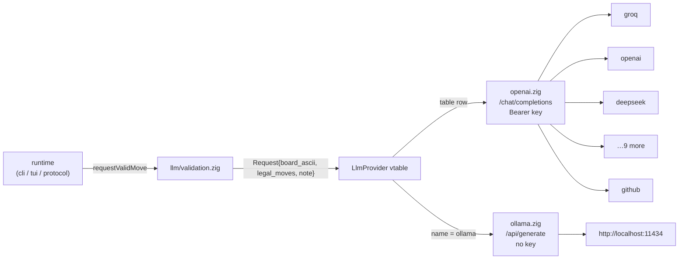
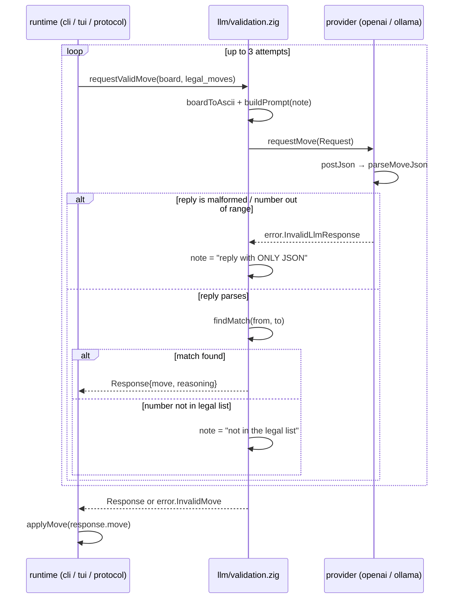

# 04 — LLM Integration

## What

An LLM can play as a player. Set `"type": "llm"` in `config.json` and the
match CLI, the TUI, or the web UI asks a chat model for the next move instead
of running minimax. The model never writes chess notation: it sees the board
as ASCII plus a numbered list of legal moves, and replies with one number.
The engine picks the move from that number, so the model cannot invent a
play.

## Why

The design is didactic: one clean seam instead of a network library.

- **Vtable interface.** Every provider implements the same two functions
  (`requestMove`, `deinit`). Adding a provider means writing one file, not
  touching the runtime.
- **OpenAI-compatible standard.** Most hosts speak the same
  `/chat/completions` JSON dialect. One provider class (`src/llm/openai.zig`)
  covers 13 of them; only the base URL and API key differ.
- **Ollama is local.** It runs a different endpoint (`/api/generate`) and
  needs no key, so a developer with no cloud account can still try an LLM
  player: `http://localhost:11434`.
- **A number, never a move string.** Parsing `{"move": 7}` is trivial and
  cannot hallucinate notation. The model's job shrinks to "pick one item
  from a list".

## How

### The provider interface

`src/llm/provider.zig` (90 lines) defines the whole contract:

- `Request` (`src/llm/provider.zig:9-14`): the board as ASCII
  (`board_ascii`), the legal moves (`legal_moves`), and an optional `note`
  — a retry hint that is empty on the first attempt and filled on retries.
- `Response` (`src/llm/provider.zig:19-22`): `reasoning` (free text, may be
  empty) plus `move`, which is the **authoritative entry from
  `legal_moves`**, resolved by list number with the captured set included.
- `LlmProvider` (`src/llm/provider.zig:24-43`): an opaque `ctx` plus a
  `VTable` (`src/llm/provider.zig:28-32`) with `requestMove` and `deinit`.
  Zig has no interfaces, so the interface is a pointer pair; callers just
  call `prov.requestMove(...)` (`src/llm/provider.zig:34-36`).

The header states the contract in one line
(`src/llm/provider.zig:1`):

```zig
//! LLM provider interface (vtable-based) and the shared prompt builder.
```



### The prompt: the model picks a NUMBER

`buildPrompt` (`src/llm/provider.zig:47-66`) assembles one user message:

1. The board as 64 ASCII chars, row-major, with a legend: `.` empty, `w`/`W`
   white pawn/king, `b`/`B` black pawn/king, space = light square
   (`src/llm/provider.zig:56`).
2. A numbered list of legal moves in `index: from,to` form, with a
   `(capture)` marker when the move captures
   (`src/llm/provider.zig:57-60`).
3. A strict reply instruction: only compact JSON `{"move": <number>}`, and
   the number must be one from the list (`src/llm/provider.zig:61`).
4. The retry `note`, appended when this is a retry
   (`src/llm/provider.zig:62-64`).

Two details make this robust:

- **The list index is 0-based** (`src/llm/provider.zig:58` prints `{d}` for
  `i` starting at 0). The number in the JSON reply is a plain array index.
  (The human CLI lists moves 1-based — `src/runtime/cli.zig:80-87` — a
  different convention, but the prompt is self-contained.)
- **`parseMoveJson` resolves the number against `legal_moves`**
  (`src/llm/provider.zig:73-90`). The returned `move` is the authoritative
  struct from the list, captured set included
  (`src/llm/provider.zig:84-85`) — never anything the model wrote.

The model cannot produce a move string, so it cannot misspell one. It can
only pick a list index, and out-of-range or malformed replies are rejected
as `error.InvalidLlmResponse` (`src/llm/provider.zig:80-84`).

### Validation and retry

`src/llm/validation.zig` (55 lines) is a small retry loop.
`requestValidMove` (`src/llm/validation.zig:18-47`) runs up to **3
attempts** (`src/llm/validation.zig:27`):

1. Build the prompt with the current `note` (empty on attempt 1) and call
   the provider.
2. If the reply fails JSON parsing or number resolution
   (`error.InvalidLlmResponse`), set a note and retry
   (`src/llm/validation.zig:33-35`):
   `Reply with ONLY the JSON object {"move": <number>} — nothing else.`
3. If the number parses but the move is not in the legal list, free the
   reasoning, set a different note, and retry
   (`src/llm/validation.zig:42-44`):
   `Your previous move number is not in the legal list. Reply with one
   number from the legal moves list.`
4. After 3 attempts: `error.InvalidMove` (`src/llm/validation.zig:46`).

The membership check `findMatch` (`src/llm/validation.zig:50-55`) compares
`from`/`to` only. The comment at `src/llm/validation.zig:39-41` explains
why it never overwrites `resp.move`: two capture chains may share
`from`/`to`, and `parseMoveJson` already resolved the authoritative entry.



### HTTP: std-only, with a timeout story

`src/utils/http.zig` (197 lines) is a minimal blocking JSON POST built on
`std.http.Client`. The header explains the hard constraint
(`src/utils/http.zig:1-11`): Zig 0.16's `std.http.Client` has **no timeout
support**, so a silent endpoint would block the caller forever. The fix:

- The whole exchange runs on a **worker thread**
  (`src/utils/http.zig:90`); the caller waits with its own deadline.
- Connect deadline 10 s, read deadline 30 s
  (`src/utils/http.zig:18-20`). The caller gives up at the deadline
  (`src/utils/http.zig:75-82`).
- An abandoned worker is detached and leaks — the only way to cancel a
  blocking `std.http` call in this std version (ponytail note,
  `src/utils/http.zig:76`).
- Non-2xx status → `error.HttpStatus`, status printed
  (`src/utils/http.zig:126-133`).
- groq/openai gzip responses even when unadvertised; the client reads
  through the stdlib decompressor (`src/utils/http.zig:138-141`). Body
  capped at 1 MiB (`src/utils/http.zig:142`).
- On 3xx redirects, `std.http` forwards headers including `Authorization` —
  accepted because these endpoints never redirect POSTs
  (`src/utils/http.zig:116-118`).

### Two providers, one wire protocol per family

`src/llm/openai.zig` (96 lines) implements the OpenAI-compatible family.
`requestMove` (`src/llm/openai.zig:51-73`):

- builds the shared prompt, then the URL by appending `/chat/completions` to
  the base (`src/llm/openai.zig:57`),
- sends `Authorization: Bearer <key>` (`src/llm/openai.zig:60`),
- posts a body with a system message ("Reply ONLY with compact JSON",
  `src/llm/openai.zig:13`) and `temperature: 0`
  (`src/llm/openai.zig:77-79`),
- extracts `choices[0].message.content`
  (`src/llm/openai.zig:84-94`) and hands it to the shared
  `parseMoveJson`.

`src/llm/ollama.zig` (77 lines) is the same shape with a different endpoint:
`/api/generate`, no auth headers, and a body that requests JSON output
(`"format": "json"`) (`src/llm/ollama.zig:51-54`). It reads the reply from
the `response` field (`src/llm/ollama.zig:68-75`). No key anywhere.

### Factory and auto-detection

`src/llm/factory.zig` (72 lines) turns a name into a provider.
`fromConfig` (`src/llm/factory.zig:58-72`):

- `ollama` → `ollama.init` with hard-coded `http://localhost:11434`
  (`src/llm/factory.zig:61-63`);
- any table name → `openai.init` with the key read from the env
  (`src/llm/factory.zig:64-70`);
- anything else → `error.UnknownProvider`
  (`src/llm/factory.zig:71`).

The provider table (`src/llm/factory.zig:21-35`) maps name → base URL →
key env var, in a fixed order: **groq, openai, deepseek, mistral, together,
fireworks, xai, cerebras, openrouter, perplexity, sambanova, deepinfra,
github** (13 OpenAI-compatible rows; `ollama` is deliberately **not** in the
table — a `comptime` assertion forbids it, `src/llm/factory.zig:37-42`).
With ollama that is 14 providers total. The same table appears as
documentation in the root README (`README.md:46-61`).

Auto-detection: `detectProvider` (`src/llm/factory.zig:46-53`) returns the
first provider whose `*_API_KEY` env var is set **and non-empty**
(`src/llm/factory.zig:48-49`). Table order wins when several keys are set
(comment, `src/llm/factory.zig:44-45`).

Precedence: `--provider <name>` beats `config.json`, which beats
auto-detect. The flag is parsed in `src/damas.zig:53-60`, forwarded to the
match CLI, TUI, and web (`src/damas.zig:77-78`), and applied inside
`playLlm` by overwriting the config's provider
(`src/runtime/cli.zig:114-116`). A missing key exits with a friendly
message (`src/runtime/cli.zig:118-122`).

### The default model

`DEFAULT_LLM_MODEL = "llama-3.3-70b-versatile"` lives in the protocol
module (`src/runtime/protocol.zig:16`). It is used when a `request_llm`
WebSocket message has no `model` field (`src/runtime/protocol.zig:112`).
The web UI mirrors it as the default value of the model input
(`apps/web/index.html:56`).

### Where the LLM player plugs in

**config.json.** `"type": "llm"` is parsed by `parsePlayer`
(`src/utils/config.zig:85-113`, llm branch at
`src/utils/config.zig:91-102`). `LlmConfig` holds optional `provider`
(null = auto-detect) and required `model`
(`src/utils/config.zig:9-13`). `player_white` / `player_black` both accept
it (`src/utils/config.zig:54-56`).

**Match CLI.** The per-turn player switch dispatches `.llm` to `playLlm`
(`src/runtime/cli.zig:62-70`), which builds the provider once per match
(`src/runtime/cli.zig:113-117`), runs `requestValidMove`, and prints the
chosen move plus reasoning (`src/runtime/cli.zig:128-138`).

**TUI.** `damas tui` receives the same `--provider` flag
(`src/damas.zig:78`) and uses the provider from config/env.

**Web server.** The server injects a factory-backed builder into the
connection state: `serveGame` sets `build_provider = defaultProvider`
(`src/runtime/websocket/server.zig:207-211`, builder at
`src/runtime/websocket/server.zig:24-26`). The pure protocol layer just
calls it on the `request_llm` action (`src/runtime/protocol.zig:111-124`);
when construction fails (e.g. no key) the state JSON answers
`"LLM provider unavailable"` (`src/runtime/protocol.zig:113-114`).

**WASM/static: disabled by design.** `src/wasm_api.zig` leaves
`ConnState.build_provider` null (`src/wasm_api.zig:5-6`,
`src/wasm_api.zig:35`), so `request_llm` always answers "LLM provider
unavailable". The web frontend does the same on its side: `initWasm` calls
`setLlmUnavailable()` (`apps/web/app.js:212`), which disables the button
(`apps/web/app.js:249`) and shows a note. `setBusy` also guards it with
`btnLlm.disabled = v || wasmMode` (`apps/web/app.js:71`).

### Testability

The LLM and WebSocket test suites run **without a network**. They exercise
the real code paths through fake vtable implementations and canned JSON
bodies:

- `src/llm_tests.zig:1-4` — "No network: providers are compile-checked and
  exercised via fake vtables and canned response bodies." `fromConfig` is
  routed for unknown/ollama/table names without a socket
  (`src/llm_tests.zig:31-39`).
- `src/ws_tests.zig:1-3` — "No sockets: `handleMessage` is exercised
  directly with a fake LLM provider." The fake returns the first legal move
  (`src/ws_tests.zig:31-38`), injected straight into `ConnState` — the same
  slot the server fills with `defaultProvider`.

This works because the network boundary is thin: `requestMove` is just a
vtable call, and each provider's parsing is a pure function
(`parseChatResponse`, `parseGenerateResponse`) that the tests feed canned
bodies.

## Code tour

- Interface + shared prompt: `src/llm/provider.zig:9-14` (`Request`),
  `src/llm/provider.zig:19-22` (`Response`),
  `src/llm/provider.zig:28-32` (`VTable`),
  `src/llm/provider.zig:47-66` (`buildPrompt`),
  `src/llm/provider.zig:73-90` (`parseMoveJson`).
- Retry loop: `src/llm/validation.zig:18-47` (`requestValidMove`),
  `src/llm/validation.zig:50-55` (`findMatch`).
- HTTP: `src/utils/http.zig:47-87` (`postJson`),
  `src/utils/http.zig:90-148` (`worker`), deadlines
  `src/utils/http.zig:18-21`.
- Providers: `src/llm/openai.zig:51-73` (request),
  `src/llm/openai.zig:77-94` (body + parse);
  `src/llm/ollama.zig:45-63` (request),
  `src/llm/ollama.zig:68-75` (parse).
- Factory: `src/llm/factory.zig:21-35` (table),
  `src/llm/factory.zig:46-53` (`detectProvider`),
  `src/llm/factory.zig:58-72` (`fromConfig`).
- Wiring: `src/runtime/cli.zig:106-139` (`playLlm`),
  `src/runtime/protocol.zig:111-124` (`request_llm`),
  `src/damas.zig:53-60` (`--provider`),
  `src/wasm_api.zig:35` (LLM null in WASM),
  `apps/web/app.js:248-261` (`setLlmUnavailable`).
- Config: `src/utils/config.zig:91-102` (llm player),
  `src/utils/config.zig:142-153` (`apiKey`).

## Try it

```sh
zig build   # native binary → zig-out/bin/damas
```

A working `config.json` in the cwd — llm white against the minimax engine
(the root README shows the llm fragment, `README.md:37-39`):

```json
{
  "player_white": { "type": "llm", "provider": "groq", "model": "llama-3.3-70b-versatile" },
  "player_black": { "type": "minimax", "time_limit_ms": 1000 }
}
```

Run with a Groq key (auto-detect finds `GROQ_API_KEY` first in the table):

```sh
GROQ_API_KEY=gsk_... zig-out/bin/damas
```

Or force a provider with `--provider` (beats `config.json`):

```sh
zig-out/bin/damas --provider groq
```

No cloud account? Run Ollama locally — no key needed:

```sh
ollama pull llama3.2        # one-time
zig-out/bin/damas --provider ollama
```

Note: `config.json` is still required, because the match CLI always loads it
(`src/runtime/cli.zig:25-31`) — the model name comes from there.

Web UI with a live LLM button (server-side provider):

```sh
zig-out/bin/damas web       # then click "LLM move" in the browser
```

The static WASM bundle (`zig build web`) has LLM play disabled; only the
`damas web` server path can talk to a provider.

## Further reading

- [02-architecture](02-architecture.md) — where the LLM layer sits between runtime and engine
- [03-engine](03-engine.md) — the other non-human player: negamax search
- [06-web-server](06-web-server.md) — the WebSocket transport that injects the provider
