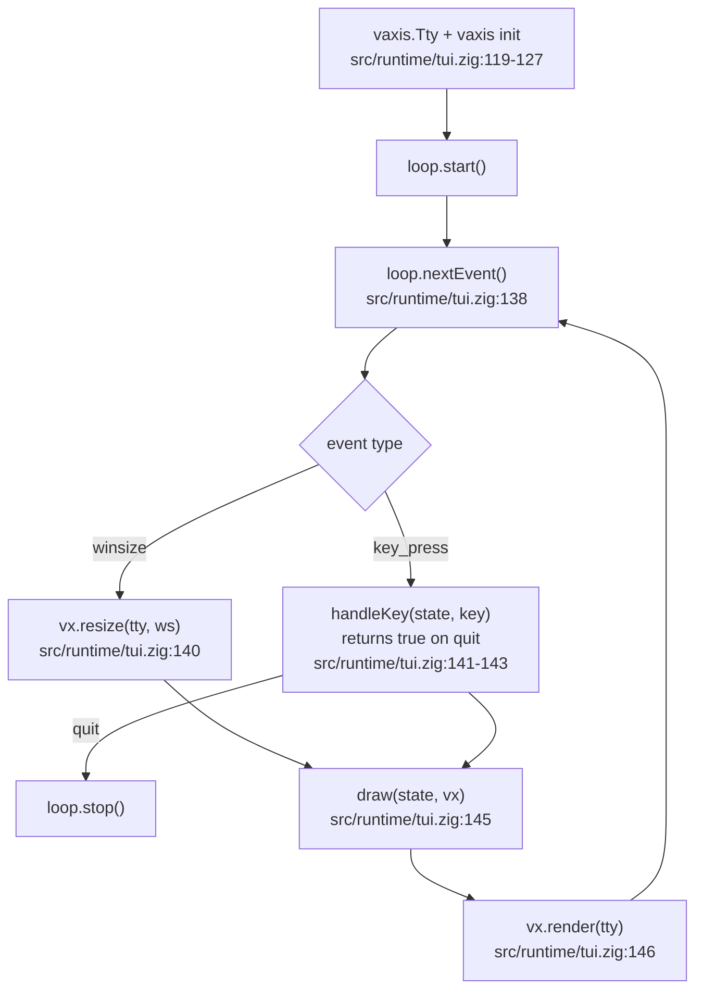

# 05 — TUI: the terminal interface

## What

`damas tui` is a full-screen, keyboard-driven checkers interface. It is the
only part of the binary that uses an external dependency — libvaxis — which
owns the terminal state (raw mode, alt screen, resize events, key parsing)
and provides a cell buffer with truecolor styles. The game logic stays in the
core.

## Why

The TUI is a second frontend on the same core, with no extra backend. It is
the living proof that the core does not depend on any UI: `src/runtime/tui.zig`
imports `game`, `move`, `board`, `minimax`, and the LLM layer, and only adds
the vaxis rendering on top. It reads the same `config.json` and honors the
same `--rules` / `--provider` flags as the match CLI.

## How

### The event loop

The whole UI is one loop: wait for an event, update state, redraw:



Setup before the loop (`src/runtime/tui.zig:119-135`):

- `vaxis.Tty.init` opens the terminal; `vaxis.init` creates the vaxis context.
- `vaxis.Loop(Event).init` owns the event stream — one custom event type,
  and it is **keyboard-only**: "the TUI never used the mouse"
  (`src/runtime/tui.zig:42-47`), plus the mandatory `winsize` for resize.
- `loop.installResizeHandler` covers terminals without in-band resize
  (SIGWINCH fallback); the loop also posts an initial winsize on start, so
  the first frame is always sized (`src/runtime/tui.zig:129-132`).
- `enterAltScreen` + `queryTerminal` switch to the alternate screen and probe
  capabilities (`src/runtime/tui.zig:134-135`).

Each iteration ends with `draw` + `vx.render` — vaxis diffs the cell buffer
and writes only the changed cells.

### Drawing the board

The board is a grid of colored cells with **no grid lines** — the
checkerboard comes from alternating cell tones, in the same green-on-dark
family as the web UI (which uses `#0a120a`/`#153015`/`#33ff33`,
`apps/web/style.css:2-9`).

Cell sizes adapt to the terminal:

```zig
const cell_h = @max(1, (rows -| 7) / 8); // board is 8*H lines + 7 fixed
const c_budget = if (side) (cols -| (panel_w + 13)) / 8 else (cols -| 11) / 8;
const cell_w: usize = @max(1, @min(2 * cell_h, c_budget));
```
(`src/runtime/tui.zig:519-521`)

Cells are roughly twice as tall as wide, which compensates for terminal
characters being ~2x taller than wide — a full-width disc of `cell_h` lines
reads as a circle in pixels (`src/runtime/tui.zig:515-516`).

Pieces are drawn as full-width circles built from half/full block characters
(`▄`/`█`/`▀`) in `drawPiece` (`src/runtime/tui.zig:444-484`). The palette is
the same green-on-dark family as the web UI — close, not identical hexes
(the web uses `#0a120a`/`#153015`/`#33ff33`, `apps/web/style.css:2-9`):
`src/runtime/tui.zig:24-26` describes it in its own comment; the color
constants live at `src/runtime/tui.zig:27-38`.

The board background is dark green (`#0e2111` playable, `#122b16`
non-playable); pieces are bright green (`#00ff3b`); black discs have a
near-black fill ringed in green. Kings get a `♔`/`♚` marker overlaid on the
middle row (`src/runtime/tui.zig:567-571`).

State highlights share the palette: cursor, selected square, and legal
targets get distinct greens in `cellBg` (`src/runtime/tui.zig:655-668`).

### stdNum notation

Every square shows its standard number, rendered dim in the top-left corner
of the cell (`src/runtime/tui.zig:557-558`). The mapping depends on the
variant (`src/runtime/tui.zig:359-369`):

- **Spanish**: `sq + 1` — the TUI's orientation (white at top) matches
  Spanish numbering directly.
- **English**: the numbering is flipped 180°, because the English standard
  puts black on 1–12 while the TUI shows white at top.

The comment pins the mapping to reality: "same mapping as the web UI,
verified against the 1981 Tinsley–Long record: 9-14 23-18 14x23 27x18"
(`src/runtime/tui.zig:359-363`).

### Connecting to the core

The TUI loads the same `config.json` as the match CLI, defaulting to
Spanish, human vs human when the file is missing
(`src/runtime/tui.zig:101-109`). The `--rules` flag beats the file:

```zig
if (rules_flag) |v| cfg.rules = v; // flag beats config.json
```
(`src/runtime/tui.zig:110`)

One important subtlety: **config player types don't auto-play in the TUI.**
The human always moves with the keyboard; `m` triggers the engine and `l`
triggers the LLM manually. The config types feed two things:

- **Engine time limit** — if the side to move is a `minimax` player in
  config, `m` uses its `time_limit_ms`; otherwise a default of 1000 ms
  (`src/runtime/tui.zig:292-299`).
- **LLM config** — if the side is an `llm` player, `l` uses its model; the
  `--provider` flag beats the config's provider, like in the CLI
  (`src/runtime/tui.zig:338-350`).

Moves flow through the same `Game` as everywhere else: `handleEnter` applies
a validated move (`src/runtime/tui.zig:200-212`), `engineMove` calls
`minimax.search` (`src/runtime/tui.zig:275-290`), `llmMove` runs the
validation loop (`src/runtime/tui.zig:301-327`). History is rendered as
standard notation — `"N. 11-15"`, with `x` for captures
(`src/runtime/tui.zig:372-375`, `378-382`).

## Code tour

Section by section, top to bottom:

- **State** — cursor, selection, legal targets, history, message:
  `src/runtime/tui.zig:49-93`.
- **Setup** — config load, game init, vaxis init, alt screen:
  `src/runtime/tui.zig:98-135`.
- **Main loop** — event dispatch + redraw: `src/runtime/tui.zig:137-147`.
- **Keys** — all bindings in one function: `src/runtime/tui.zig:153-178`.
- **Selection & moves** — cursor wrap-around (`180-188`), Enter
  select/execute (`190-226`), legal targets computed from
  `game.generateMoves` (`234-242`).
- **Actions** — new game (`263-273`), engine move (`275-290`), LLM move
  (`301-327`).
- **Notation** — `stdNum` (`364-369`), `moveNotation` (`372-375`), history
  entries (`378-382`).
- **Rendering** — `Line` helper writing segments (`392-415`), `writeNum`
  with static digit slices (`420-428`), `drawPiece` circles (`444-484`),
  `draw` full-screen layout (`489-632`), status line (`634-653`), cell
  colors (`655-668`).
- **Tests** — the stdNum anchors live in `tui.zig` itself
  (`src/runtime/tui.zig:675-692`); `src/tui_tests.zig` (8 lines) is just the
  module anchor that imports the file. Because `tui.zig` imports vaxis, the
  test module needs the same import wiring as the exe: `build.zig:126-137`
  (the `addImport("vaxis", ...)` is at `build.zig:136`).

## Try it

```sh
zig build                          # binary → zig-out/bin/damas
zig-out/bin/damas tui              # default: Spanish, human vs human
zig-out/bin/damas tui --rules english
zig-out/bin/damas tui --provider groq   # LLM player uses this provider
```

Keys, as wired in `src/runtime/tui.zig:153-178` (also shown in the footer
hint `[n]ew  [m]achine  [l]LM  [h]elp  [q]uit`, `src/runtime/tui.zig:625`):

| Key | Action |
|-----|--------|
| Arrow keys | Move the cursor (wraps around the board edge) |
| Enter | Select a piece / play the chosen move |
| Esc | Cancel the selection |
| `n` / `N` | New game (keeps the current rule variant) |
| `m` / `M` | Engine move for the current side |
| `l` / `L` | LLM move for the current side |
| `h` / `H` | Help message |
| `q` / `Q` | Quit |
| Ctrl-C | Quit cleanly |

There is no mouse support — the event union is keyboard-only
(`src/runtime/tui.zig:42-47`).

## Further reading

- [02-architecture](02-architecture.md) — where the runtime layer sits
- [03-engine](03-engine.md) — what `m` runs under the hood
- [04-llm-integration](04-llm-integration.md) — what `l` runs (LLM player with validation)
