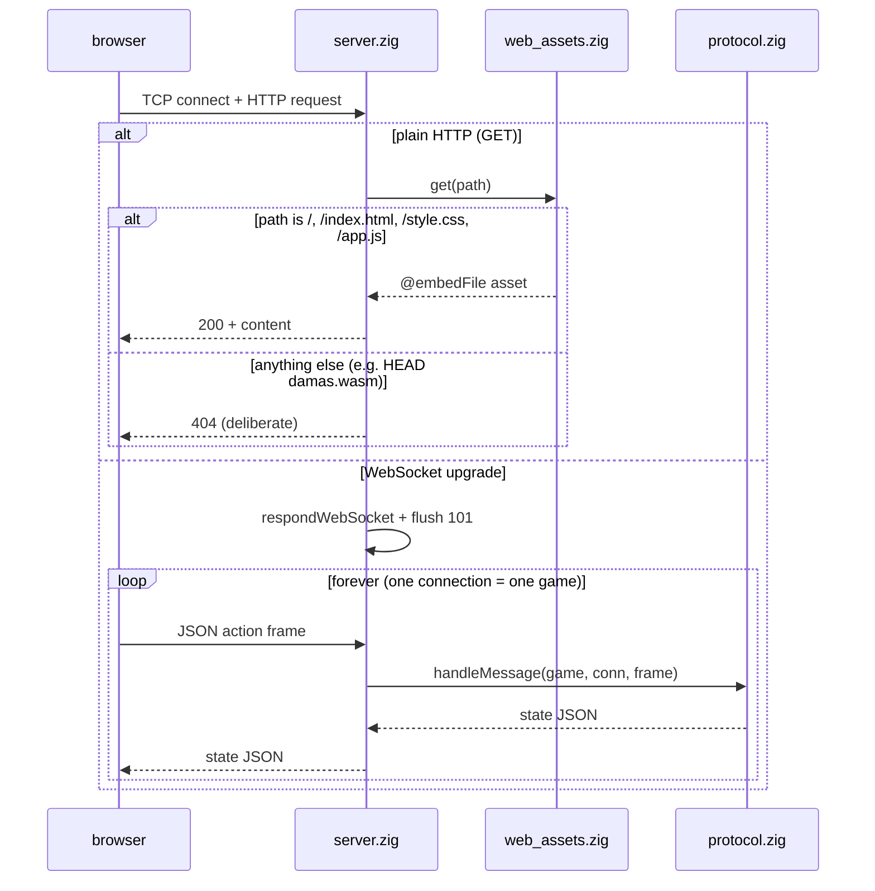

# 06 — Web Server

## What

`damas web` serves the whole web app from the binary itself: the frontend
(`apps/web/*`) and a WebSocket game server, both on the loopback interface.
There is no nginx, no separate asset folder, nothing to install. One
executable is the whole stack — the "todo en un mismo binario" requirement
(`src/damas.zig:1-3`).

## Why

- **Zero external dependencies.** The server is std-only
  (`src/runtime/websocket/server.zig:3-5`): handshake, static serving, and
  framing all come from `std.http`. A single binary deploys anywhere.
- **LLM playable.** The server can talk to an LLM provider (selected via
  `--provider` or env auto-detect; keys always come from the environment) —
  the one feature the static WASM bundle cannot offer (no secrets in static
  hosting).

## How

The server has two arms on one port. Every connection is checked once: a
WebSocket upgrade goes to the game loop, anything else gets a static asset
(`src/runtime/websocket/server.zig:189-204`).



### The plain-HTTP arm: exactly three assets, 404 on purpose

`serveStatic` (`src/runtime/websocket/server.zig:141-151`) serves only what
`web.get` returns (`src/runtime/web_assets.zig:19-36`). That is precisely
three files, each compiled into the binary with `@embedFile`:

- `/` or `/index.html` — `src/runtime/web_assets.zig:20-24`
- `/style.css` — `src/runtime/web_assets.zig:25-29`
- `/app.js` — `src/runtime/web_assets.zig:30-34`

Everything else gets `404 Not Found` (`src/runtime/web_assets.zig:35`,
`src/runtime/websocket/server.zig:148`). The 404 is **deliberate**, not a
gap: the browser uses it to detect which mode it runs in. `app.js` probes
`damas.wasm` with a `HEAD` request; the server does not serve it, so a 404
deterministically means "this is the embedded server, use WebSocket mode"
(`apps/web/app.js:192-194`).

The embeds live inside a function on purpose. `@embedFile` resolves relative
to the calling file and must stay within the module's package path — the exe
module is rooted at the repo root so `../../apps/web` resolves, while the
`ws_tests` module (rooted at `src/`) never compiles the embeds because the
tests never call `get` (`src/runtime/web_assets.zig:1-9`).

### The WebSocket arm: one connection, one game

`handleConnection` (`src/runtime/websocket/server.zig:177-205`) starts each
connection with an idle check, then reads the request head
(`src/runtime/websocket/server.zig:187-188`). On a websocket upgrade it
answers the handshake and **flushes the 101 immediately** — a deferred flush
would make the client wait for the handshake while the server blocks in
`readSmallMessage` (deadlock, verified with a raw-socket client;
`src/runtime/websocket/server.zig:192-196`).

`serveGame` (`src/runtime/websocket/server.zig:207-235`) then runs the loop:

- a fresh `Game` per connection (`src/runtime/websocket/server.zig:209`),
- one frame at a time, ping answered with pong
  (`src/runtime/websocket/server.zig:219-224`),
- every text frame goes to `protocol.handleMessage` and gets a state JSON
  back (`src/runtime/websocket/server.zig:228-233`).

The protocol module states the model in its header
(`src/runtime/protocol.zig:1-6`): one connection = one game, reset by the
`new_game` action, every action gets a state JSON response. All logic lives
there — no sockets, no HTTP — so the server only moves bytes
(`src/runtime/websocket/server.zig:1-5`).

### LLM provider injection

The server wires the LLM player without touching the protocol layer. It
injects a factory-backed builder into the connection state:

```zig
var conn = protocol.ConnState{ .build_provider = defaultProvider };
```
(`src/runtime/websocket/server.zig:211`)

`defaultProvider` calls `factory.fromConfig` with the server's provider
default (the `--provider` flag, or auto-detect)
(`src/runtime/websocket/server.zig:24-26`, default stored at
`src/runtime/websocket/server.zig:19`). The `request_llm` action then uses
it through the normal validation loop (`src/runtime/protocol.zig:111-124`).
See [04-llm-integration](04-llm-integration.md) for the provider side.

### Configuration and the browser launch

- **Port.** `DZ_WS_PORT` env var, default `8080`
  (`src/damas.zig:102-104`).
- **Skip the browser.** `DZ_NO_BROWSER=1` skips the launch — for CI and
  headless runs (`src/runtime/websocket/server.zig:51`, check at
  `src/runtime/websocket/server.zig:55`).
- **Browser launch.** `openBrowser` (`src/runtime/websocket/server.zig:61-80`)
  spawns `open` on macOS, `xdg-open` on Linux
  (`src/runtime/websocket/server.zig:64-68`); failure is non-fatal, the URL
  is printed (`src/runtime/websocket/server.zig:59-60`).
- **The zombie fix.** The launcher is fire-and-forget; without a `wait()`
  the child would linger as a zombie. `autoReapChildren`
  (`src/runtime/websocket/server.zig:86-93`) sets `SIGCHLD` to `SIG_IGN` on
  POSIX, so the kernel reaps the launcher at exit
  (`src/runtime/websocket/server.zig:82-85`). A dedicated process test
  spawns real children and asserts no `Z` state in `ps`
  (`src/runtime/websocket/server.zig:95-138`); the test module anchor is
  `server_tests_root.zig:1-7` (same repo-root constraint as the embeds).

## Code tour

- Two arms on one port: `src/runtime/websocket/server.zig:177-205`.
- Static arm: `src/runtime/websocket/server.zig:141-151`,
  `src/runtime/web_assets.zig:19-36`.
- Game loop: `src/runtime/websocket/server.zig:207-235`.
- Protocol (pure): `src/runtime/protocol.zig:1-6` (header),
  `src/runtime/protocol.zig:36` (`handleMessage`),
  `src/runtime/protocol.zig:111-124` (`request_llm`).
- Provider injection: `src/runtime/websocket/server.zig:211`,
  `src/runtime/websocket/server.zig:24-26`.
- Port / browser: `src/damas.zig:102-104`,
  `src/runtime/websocket/server.zig:52-57`,
  `src/runtime/websocket/server.zig:61-93`.
- Zombie test: `src/runtime/websocket/server.zig:95-138`,
  `server_tests_root.zig:1-7`.

## Try it

```sh
zig build
DZ_NO_BROWSER=1 zig-out/bin/damas web      # no browser launch, URL printed
```

Point a browser at `http://127.0.0.1:8080`. New game / engine move / LLM
move all work over the WebSocket; the LLM button needs an API key or a local
Ollama (see [04-llm-integration](04-llm-integration.md)).

Different port:

```sh
DZ_WS_PORT=8081 zig-out/bin/damas web
```

Without `DZ_NO_BROWSER`, the server opens your default browser itself
(macOS/Linux). `Ctrl-C` stops the accept loop.

## Further reading

- [04-llm-integration](04-llm-integration.md) — the provider injected by this server
- [07-web-wasm](07-web-wasm.md) — the same UI as a static, backend-less bundle
- [02-architecture](02-architecture.md) — where the server sits in the layer stack
