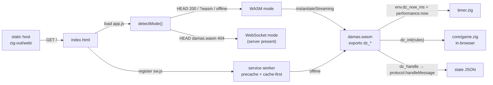

# 07 — Web WASM

## What

`zig build web` produces `zig-out/web/`: `damas.wasm` plus eight web assets,
a fully static bundle that runs the whole engine in the browser. Any static
host serves it — GitHub Pages, nginx, `python3 -m http.server`. The bundle
is also a PWA: installable on Android (TWA) and iOS (PWA), working offline
through a service worker. No backend at all.

## Why

- **Deploy without a backend.** There is no server, no API key, no
  WebSocket — just files. Static hosting is free and trivial everywhere.
- **Offline.** The service worker caches the shell and the engine, so the
  game runs without a connection.
- **Mobile apps for free.** The Android and iOS packaging targets are thin
  shells around this same bundle.

The trade-off is explicit: without a backend there are no secrets, so LLM
play is disabled in WASM mode (see [04-llm-integration](04-llm-integration.md)).

## How

### The WASM ABI

`src/wasm_api.zig` (119 lines) is the browser-side entry point. The header
(`src/wasm_api.zig:1-9`) defines the contract: the JS side writes the request
JSON into `dz_req_ptr()` (up to `dz_req_cap()` bytes), calls `dz_handle(len)`,
and reads the response from the returned `ptr<<32|len`. The response lives in
a per-message arena and is valid until the next `dz_handle` call.

Four exported functions:

- `dz_init(rules)` (`src/wasm_api.zig:47-52`) — picks the default variant
  (1 = Spanish, anything else = English) and creates the global game. The
  frontend passes the UI selector's value (`apps/web/app.js:227`).
- `dz_req_ptr()` / `dz_req_cap()` (`src/wasm_api.zig:55-62`) — the shared
  request buffer, a fixed 4096 bytes (`src/wasm_api.zig:23`).
- `dz_handle(len)` (`src/wasm_api.zig:67-83`) — resets the per-message arena
  (`src/wasm_api.zig:69`), calls the same pure `protocol.handleMessage` the
  WebSocket server uses (`src/wasm_api.zig:70-76`), and returns the response
  packed as `ptr<<32|len` on wasm32 (`src/wasm_api.zig:80-82`).

Memory: the backing allocator is `std.heap.wasm_allocator` in the browser
build, `page_allocator` in the native test (`src/wasm_api.zig:17-20`). The
global game survives arena resets by being allocated directly from `backing`
(`src/wasm_api.zig:29-31`). No LLM: `build_provider` stays null
(`src/wasm_api.zig:35`, product decision at `src/wasm_api.zig:5-6`).

The clock is external. wasm32-freestanding has no OS, so the engine imports
`dz_now_ms` from the `env` module (`src/core/engine/timer.zig:14`), used in
the wasm branch of `nowMillis` (`src/core/engine/timer.zig:29-33`). The
frontend provides it as `performance.now` (`apps/web/app.js:216`).

### Building the bundle

`build.zig` defines the `web` step (`src/build.zig:48-65`). The WASM module
is an executable targeted at `wasm32-freestanding` with `ReleaseSmall`
(`src/build.zig:49-58`) and two flags that keep it lean:

- `wasm.entry = .disabled` (`src/build.zig:60`) — no `_start`, the module is
  pure exports;
- `wasm.rdynamic = true` (`src/build.zig:61`) — keep only the exported ABI
  symbols.

The comment explains the intent: "entry disabled + rdynamic keeps only the
exported symbols; ReleaseSmall keeps the download lean"
(`src/build.zig:44-47`). The step installs `damas.wasm`
(`src/build.zig:62`) and copies eight assets from `apps/web/`
(`src/build.zig:63-65`): `index.html`, `style.css`, `app.js`,
`manifest.webmanifest`, `sw.js`, and the three icons.

### Mode detection

The same `app.js` runs against the embedded server or the static bundle.
`detectMode` (`apps/web/app.js:195-208`) decides which transport to use:

1. `?wasm` forces WASM, `?server` forces WebSocket
   (`apps/web/app.js:197-198`);
2. offline → WASM (the service worker has the engine cached; the SW does not
   intercept `HEAD`, so the probe would lie) (`apps/web/app.js:199-201`);
3. otherwise a `HEAD` probe on `damas.wasm`: the embedded server serves only
   its three assets, so a 404 deterministically means server mode
   (`apps/web/app.js:203-204`, `apps/web/app.js:192-194`).

`initWasm` (`apps/web/app.js:210-245`) then instantiates the module — with a
MIME-type fallback from `instantiateStreaming` to `arrayBuffer` for static
hosts that serve `.wasm` wrong (`apps/web/app.js:219-223`) — calls
`dz_init`, and sends `new_game`. If instantiation fails without an explicit
`?wasm`, the app degrades to the WebSocket transport instead of dying
(`apps/web/app.js:237-243`).

### The service worker

`apps/web/sw.js` makes the bundle a PWA:

- **Install.** Precache the shell — `./`, `index.html`, `style.css`,
  `app.js`, `damas.wasm`, `manifest.webmanifest` — then `skipWaiting()`
  (`apps/web/sw.js:3-16`).
- **Activate.** Delete every cache whose name is not the current versioned
  cache, then `clients.claim()` so the new SW controls open pages
  immediately (`apps/web/sw.js:18-24`). The cache name is versioned
  (`'damas-v2'`, `apps/web/sw.js:1`).
- **Fetch.** Two strategies (`apps/web/sw.js:26-64`): the shell
  (navigations, CSS, JS) is stale-while-revalidate — fresh updates without
  manual cache bumps (`apps/web/sw.js:32-49`); everything else (wasm,
  icons, manifest) is cache-first (`apps/web/sw.js:51-63`).

Registration is inline in the page (`apps/web/index.html:73-77`).

### Manifest and installability

`manifest.webmanifest` declares a standalone, portrait app with dark theme
`#050805` (`apps/web/manifest.webmanifest:6-9`) and three icons
(`apps/web/manifest.webmanifest:10-29`): 192/512 `any` plus a 512 `maskable`
for adaptive icon masks. The page links it and adds the iOS-specific Apple
meta tags (`apps/web/index.html:10-14`).

Install: Android Chrome → menu → "Add to Home screen"; iOS Safari → Share →
"Add to Home Screen". Both wrap this exact bundle — the Android TWA and iOS
PWA docs cover the packaging.



### Try it

```sh
zig build web          # zig-out/web/: damas.wasm + 8 assets
python3 -m http.server -d zig-out/web
```

Open `http://127.0.0.1:8000`. The HEAD probe finds `damas.wasm`, so the app
runs fully in the browser — no WebSocket, no server. Force the mode to prove
it:

```sh
open "http://127.0.0.1:8000/?wasm"
```

Try offline: load once, disconnect, reload — the service worker serves the
cached shell and engine.

## Code tour

- ABI: `src/wasm_api.zig:47-52` (`dz_init`), `src/wasm_api.zig:55-62`
  (buffer), `src/wasm_api.zig:67-83` (`dz_handle`),
  `src/wasm_api.zig:17-20` (allocator), `src/wasm_api.zig:35` (LLM off).
- Clock: `src/core/engine/timer.zig:14`, `src/core/engine/timer.zig:29-33`;
  host import `apps/web/app.js:216`.
- Build: `src/build.zig:48-65` (`web` step), `src/build.zig:60-61` (entry /
  rdynamic), `src/build.zig:57` (ReleaseSmall).
- Detection: `apps/web/app.js:195-208` (`detectMode`),
  `apps/web/app.js:210-245` (`initWasm`).
- Service worker: `apps/web/sw.js:3-16` (install), `apps/web/sw.js:18-24`
  (activate), `apps/web/sw.js:26-64` (fetch strategies).
- Manifest: `apps/web/manifest.webmanifest:6-9` (display/theme),
  `apps/web/manifest.webmanifest:10-29` (icons);
  page wiring `apps/web/index.html:7-13`, `apps/web/index.html:73-77`.

## Further reading

- [06-web-server](06-web-server.md) — the embedded server, the other transport
- [08-android-twa](08-android-twa.md) — Android app via Trusted Web Activity
- [09-ios-pwa](09-ios-pwa.md) — iOS app via PWA
- [03-engine](03-engine.md) — the engine running in the browser
- [10-build-ci-packaging](10-build-ci-packaging.md) — CI and release of the bundle
