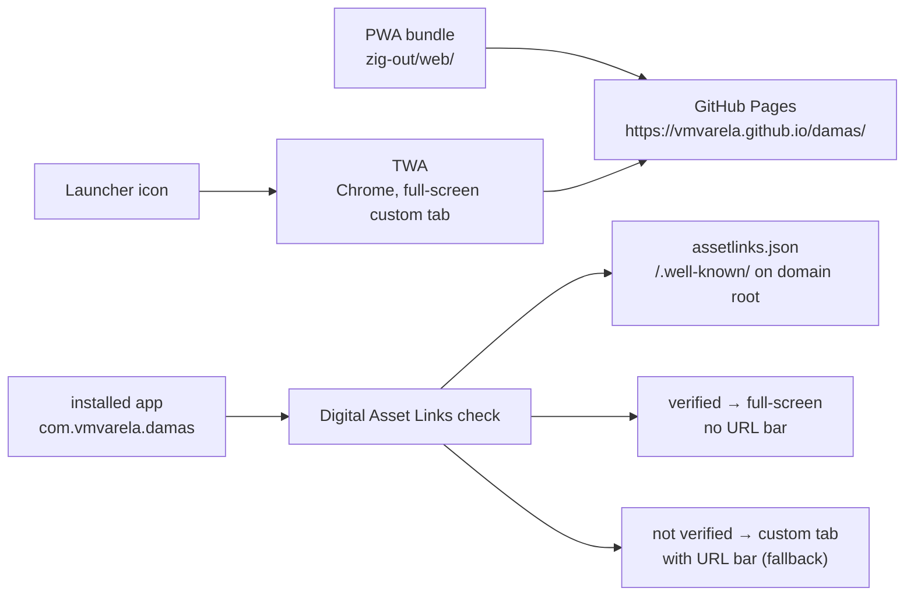
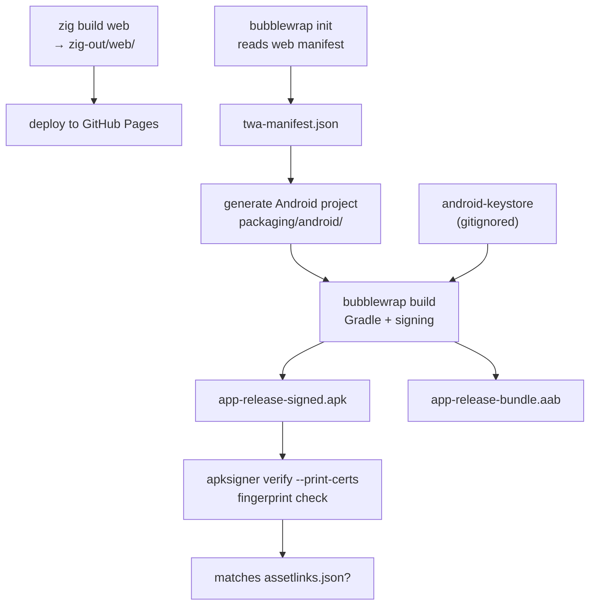

# 08 — Android: Trusted Web Activity

## What

A **Trusted Web Activity (TWA)** is the Android packaging for a PWA: the app
icon launches Chrome, which renders the web app full-screen with no URL bar —
no `WebView`, no duplicated HTML. [Bubblewrap](https://github.com/GoogleChromeLabs/bubblewrap)
(the CLI) reads the web manifest and generates a complete Android project under
`packaging/android/`. The build produces two signed artifacts:
`app-release-signed.apk` (direct install) and `app-release-bundle.aab`
(Play Store upload, not used here).

## Why

The PWA from [07-web-wasm](07-web-wasm.md) is the single codebase. A TWA adds
an installable icon and an app-like experience without writing a second
frontend:

- **No distribution cost** — the APK ships as a GitHub release artifact, no
  Play Store needed.
- **One codebase** — every fix to `apps/web/*` reaches Android on the next
  build.
- **Chrome renders it** — same engine as the browser, no embedded browser to
  maintain.
- **Provable ownership** — a Digital Asset Links file ties the app's signing
  fingerprint to the domain, instead of trusting a wrapper blindly.

## How

### Runtime: what Chrome does



The TWA holds the `applicationId` `com.vmvarela.damas` and an intent-filter for
`https://vmvarela.github.io`. Chrome verifies the domain owns that app via
`assetlinks.json`, and only then grants the full-screen experience. Without
verification the app still works, but inside a custom tab that keeps the URL
bar (`fallbackType: customtabs`, `app/build.gradle:48`).

### The Digital Asset Links file

`packaging/android/assetlinks.json` declares the relationship
(`assetlinks.json:2-6`):

```json
{
  "relation": ["delegate_permission/common.handle_all_urls"],
  "target": {
    "namespace": "android_app",
    "package_name": "com.vmvarela.damas",
    "sha256_cert_fingerprints": ["36:24:D4:58:66:48:B4:AE:C7:82:C1:24:21:BF:05:B4:40:22:D1:CD:6F:A9:40:6F:E6:C8:0D:19:9C:04:8F:3A"]
  }
}
```

Two hard rules:

1. The fingerprint must be the **signing certificate's** SHA-256 of the APK you
   actually ship — any mismatch breaks verification.
2. It must be served at **`https://vmvarela.github.io/.well-known/assetlinks.json`** —
   HTTPS, no redirects. The site lives under `/damas/`, but the file goes on
   the **domain root**, which is a different repo (`vmvarela/vmvarela.github.io`)
   updated by hand. `packaging/android/assetlinks.json` is the reference copy;
   this repo does not contain `.well-known/`.

### Build flow



`bubblewrap init` generates the project once; `bubblewrap update` re-applies a
changed `twa-manifest.json` to an existing project. `bubblewrap build` runs the
Gradle build and signs with the local keystore.

### Signing

The keystore `packaging/android/android-keystore` is gitignored. It is stored
as the CI secret `ANDROID_KEYSTORE_B64` (base64) and decoded before the build
(`.github/workflows/android.yml:41-42`).

PKCS12 gotcha: in a PKCS12 keystore the store password also protects the key.
Bubblewrap reads two env vars, so both must carry the **same value**
(`.github/workflows/android.yml:46-49`):

```yaml
BUBBLEWRAP_KEYSTORE_PASSWORD: ${{ secrets.BUBBLEWRAP_KEYSTORE_PASSWORD }}
BUBBLEWRAP_KEY_PASSWORD: ${{ secrets.BUBBLEWRAP_KEYSTORE_PASSWORD }}
```

### CI workflow (`android.yml`)

| Step | Lines | What it does |
|------|-------|--------------|
| Triggers | `android.yml:4-6` | `v*` tags + `workflow_dispatch` |
| JDK 17 | `android.yml:18-22` | Temurin 17 via `setup-java` |
| Android SDK | `android.yml:24-25` | `android-actions/setup-android` |
| Licenses + build-tools + config | `android.yml:27-36` | Accept SDK licenses, install `build-tools;36.1.0`, write `~/.bubblewrap/config.json` |
| Bubblewrap | `android.yml:38-39` | `npm i -g @bubblewrap/cli@1.25.0` |
| Keystore | `android.yml:41-42` | Decode `ANDROID_KEYSTORE_B64` → `android-keystore` |
| Build | `android.yml:44-50` | `bubblewrap build` → APK + AAB |
| Verify fingerprint | `android.yml:52-56` | `apksigner verify` against the assetlinks fingerprint |
| Upload | `android.yml:58-65` | Artifacts: APK, AAB, assetlinks.json |
| Release | `android.yml:67-73` | Attach APK + AAB to the GitHub release on tag |

## Code tour

### `packaging/android/twa-manifest.json` — Bubblewrap's source of truth

| Ref | Line | Value |
|-----|------|-------|
| `packageId` | `twa-manifest.json:2` | `com.vmvarela.damas` — the `applicationId`, never change after release |
| `host` | `twa-manifest.json:3` | `vmvarela.github.io` — domain opened by the TWA |
| `startUrl` | `twa-manifest.json:14` | `/damas/` — relative to the host |
| `appVersionCode` | `twa-manifest.json:19` | `1` — bump on every release |
| `minSdkVersion` | `twa-manifest.json:20` | `21` (Android 5.0) |
| `signingKey` | `twa-manifest.json:26-29` | `path: ./android-keystore`, `alias: damas` |

### `packaging/android/app/build.gradle` — the generated Android module

| Ref | Line | Value |
|-----|------|-------|
| `compileSdkVersion` | `app/build.gradle:54` | `36` |
| `applicationId` | `app/build.gradle:57` | `com.vmvarela.damas` |
| `minSdkVersion` / `targetSdkVersion` | `app/build.gradle:58-59` | `21` / `36` |
| `versionCode` / `versionName` | `app/build.gradle:60-61` | `1` / `"1.0.0"` |
| `launchUrl` resValue | `app/build.gradle:70-71` | `https://` + host + `/damas/` |
| `webManifestUrl` resValue | `app/build.gradle:79` | points Chrome OS/Quest to the web manifest |
| dependency | `app/build.gradle:208` | `com.google.androidbrowserhelper:androidbrowserhelper:2.6.2` |

The top-level `build.gradle:26` pins the Android Gradle Plugin to **8.9.1**;
the wrapper uses Gradle **8.11.1** (`gradle/wrapper/gradle-wrapper.properties:5`).

### `app/src/main/AndroidManifest.xml` — what makes it a TWA

- **`LauncherActivity`** (`AndroidManifest.xml:77-158`) — the entry activity. Its
  `DEFAULT_URL` meta-data (`AndroidManifest.xml:81-82`) is the launch URL; the
  colors, splash and orientation are passed as meta-data resolved from the
  `resValue` strings above.
- **Launcher intent-filter** (`AndroidManifest.xml:140-143`) — `MAIN` +
  `LAUNCHER`: the app appears in the launcher.
- **The TWA intent-filter** (`AndroidManifest.xml:145-153`) — `autoVerify="true"`,
  `VIEW`, `BROWSABLE`, `https` scheme, host from `@string/hostName`. This is
  the filter Chrome matches against `assetlinks.json` to grant full-screen.
- **`FileProvider`** (`AndroidManifest.xml:165-173`) — serves the splash image
  to the TWA.
- **`DelegationService`** (`AndroidManifest.xml:175-186`) — notification
  delegation, disabled because `enableNotifications` is `false`
  (`twa-manifest.json:21`).

## Known issues

1. **The fingerprint comes from the local keystore, not the secret.** On first
   run the build succeeded but the "Verify signing fingerprint" step failed:
   `ANDROID_KEYSTORE_B64` encoded a different (older) keystore than
   `packaging/android/android-keystore`. Fixed by regenerating the secret from
   the local keystore (`base64 -i packaging/android/android-keystore | gh
   secret set ANDROID_KEYSTORE_B64`). The step now prints the actual
   certificate on failure (`android.yml:55-56`) so mismatches are debuggable.
   The macOS SDK-path blocker is also fixed: the step uses
   `$ANDROID_HOME/build-tools/36.1.0/apksigner` (`android.yml:54`) and
   `build-tools;36.1.0` is installed explicitly (`android.yml:31`).
2. **The keystore is irreplaceable.** `android-keystore` is gitignored and only
   exists as a local file plus the CI secret. If it is lost, the same
   `applicationId` can never be updated: a new key changes the SHA-256
   fingerprint, which breaks `assetlinks.json` verification. Back it up off
   repo and keep the secret safe. If the secret ever drifts from the local
   keystore, the Verify step catches it before release.

## Try it

Local build (needs JDK 17, Android SDK, Node, and `~/.bubblewrap/config.json`
with `jdkPath`/`androidSdkPath`, as `android.yml:27-36` does):

```sh
cd packaging/android
bubblewrap build                    # → app-release-signed.apk + app-release-bundle.aab
bubblewrap install                  # adb install to a connected device
```

Or trigger the workflow: GitHub → **Actions** → *Build TWA APK/AAB* →
**Run workflow**, then download the artifact and `adb install
app-release-signed.apk`.

Verify the installed signature matches the assetlinks fingerprint:

```sh
apksigner verify --print-certs app-release-signed.apk
# expect 36:24:D4:58:66:48:B4:AE:C7:82:C1:24:21:BF:05:B4:40:22:D1:CD:6F:A9:40:6F:E6:C8:0D:19:9C:04:8F:3A
```

## Further reading

- [07-web-wasm](07-web-wasm.md) — the PWA that the TWA wraps
- [01-overview](01-overview.md) — one core, four entry points
- [09-ios-pwa](09-ios-pwa.md) — the iOS counterpart (no wrapper, just Safari)
- [10-build-ci-packaging](10-build-ci-packaging.md) — build system and CI
