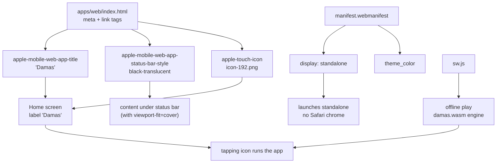

# 09 — iOS: PWA

## What

There is no Trusted Web Activity on iOS. The iOS "app" is the PWA from
[07-web-wasm](07-web-wasm.md), installed through Safari: open the site, tap
**Share → Add to Home Screen**, and the launcher gets an icon that opens the
page standalone. Cost: zero. No App Store, no review, no yearly fee.

## Why

The PWA path is the pragmatic answer on iOS:

- **It is the supported native path.** Safari has offered installable
  web apps since iOS 17, honoring the web manifest.
- **Free.** Apple's fee and review process disappear.
- **Offline already works.** The service worker precaches the page and the
  WASM engine, so the game runs without a network connection.
- **A wrapper is not worth it.** All alternatives were weighed and rejected
  (see [Limitations](#limitations)): PWABuilder's iOS wrapper is archived and
  community-driven; Capacitor costs $99/year and risks App Store Guideline 4.2
  (repackaged websites); AltStore sideloading needs a certificate that expires
  every 7 days.

## How

Safari merges two sources: the `<meta>` tags and `<link>` tags in
`index.html`, and the web manifest. The result is an installable, standalone
app:



### What each tag does

| Tag | Ref | Effect |
|-----|-----|--------|
| `viewport-fit=cover` | `index.html:5` | Content extends into the notch and rounded corners instead of letterboxing |
| `apple-mobile-web-app-capable=yes` | `index.html:10` | Legacy standalone-mode opt-in; modern iOS also reads the manifest |
| `apple-mobile-web-app-title` | `index.html:11` | The name shown under the home-screen icon: `Damas` |
| `apple-mobile-web-app-status-bar-style` | `index.html:12` | `black-translucent`: content draws under the status bar — paired with `viewport-fit=cover` |
| `apple-touch-icon` | `index.html:14` | Home-screen icon. 180px is ideal; `icon-192.png` is used and iOS scales it |
| `theme-color` | `index.html:8` | Used by Chrome/Android; Safari ignores it |
| `<link rel="manifest">` | `index.html:7` | Points Safari at `manifest.webmanifest` |

### Why offline works

The service worker `apps/web/sw.js` precaches the whole shell — `./`,
`index.html`, `style.css`, `app.js`, `damas.wasm`, `manifest.webmanifest`
(`sw.js:3-16`). HTML/CSS/JS are served stale-while-revalidate (fresh from
network when online, cached fallback when offline, `sw.js:33-49`); everything
else is cache-first (`sw.js:52-63`). In wasm mode the game engine runs fully
in the browser, so no server is needed. The LLM button is disabled there
because an API key cannot exist client-side (`apps/web/app.js:247-260`).

## Code tour

### `apps/web/index.html:5-14` — the iOS metadata block

```html
<meta name="viewport" content="width=device-width, initial-scale=1, viewport-fit=cover">
<link rel="manifest" href="manifest.webmanifest">
<meta name="theme-color" content="#050805">
<meta name="mobile-web-app-capable" content="yes">
<meta name="apple-mobile-web-app-capable" content="yes">
<meta name="apple-mobile-web-app-title" content="Damas">
<meta name="apple-mobile-web-app-status-bar-style" content="black-translucent">
<link rel="apple-touch-icon" href="icon-192.png">
```

### `apps/web/manifest.webmanifest` — install metadata

- `name` `Damas — Spanish Checkers` (`manifest.webmanifest:2`), `short_name`
  `Damas` (`manifest.webmanifest:3`).
- `display: standalone` (`manifest.webmanifest:6`) — no browser chrome.
- Icons (`manifest.webmanifest:10-29`) — 192px and 512px (`any`) plus a
  maskable 512px.

### `apps/web/sw.js` — the offline layer

- Cache name `damas-v2` (`sw.js:1`) — bump to force a full refresh.
- `install`: precache shell + wasm, `skipWaiting` (`sw.js:3-16`).
- `activate`: delete old caches, `clients.claim` (`sw.js:18-24`).
- `fetch`: same-origin GETs only; shell stale-while-revalidate
  (`sw.js:33-49`), assets cache-first (`sw.js:52-63`).

## Limitations

- **iOS < 16.4 ignores manifest icons** — the `apple-touch-icon` link tag is
  required, and that is why it exists next to the manifest
  (`index.html:14`).
- **Safari may evict cached data** after long periods without use. If the app
  shows the browser once in a while, open it and it re-caches.
- **No push notifications** — acceptable here; the game is local and has no
  server-initiated events.
- **No wrapper — deliberate.** PWABuilder's iOS path is archived and
  community-maintained; Capacitor would add $99/year plus the risk of App
  Store Guideline 4.2 ("repackaged website") rejection; AltStore sideloading
  requires re-signing every 7 days. The PWA covers the use case at zero cost.
- The site is already live at `https://vmvarela.github.io/damas/` — no extra
  deployment needed.

## Try it

1. On iPhone/iPad, open `https://vmvarela.github.io/damas/` in Safari.
2. Tap **Share** (square with arrow) → **Add to Home Screen** → **Add**.
3. Verify: icon labeled `Damas` on the home screen; launching shows no Safari
   chrome and the status bar overlays the dark background.
4. Turn on **Airplane mode** and play — the board, rules selector and engine
   moves work offline. The LLM button is disabled (no backend in wasm mode).

## Further reading

- [07-web-wasm](07-web-wasm.md) — the PWA base both mobile targets share
- [08-android-twa](08-android-twa.md) — the Android contrast: native wrapper,
  signing, asset links
- [01-overview](01-overview.md) — one core, four entry points
