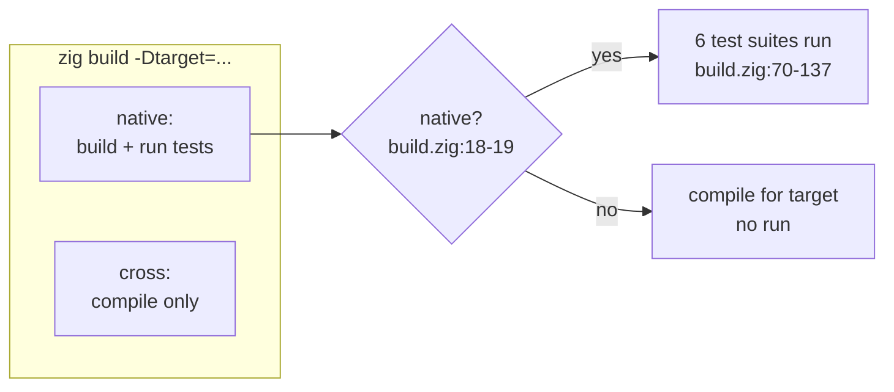
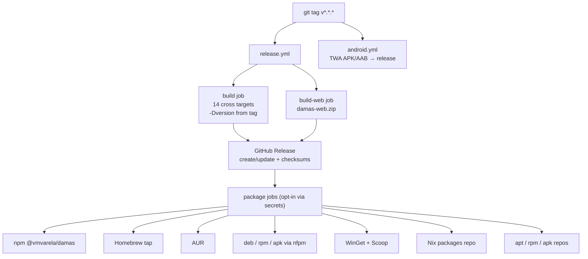

# 10 — Build, CI and packaging

## What

One Zig 0.16 repository produces 14 cross-compiled binaries, a WASM web
bundle, an Android TWA app, and native packages (deb, rpm, apk, npm, WinGet,
Scoop, Nix, Homebrew, AUR) — all from a single `build.zig` and a set of GitHub
Actions workflows. `zig build` is the only build tool; CI is where every
target gets compiled and smoke-tested.

## Why

Two principles drive the setup:

- **One build per environment.** The same `build.zig` handles the native exe,
  the WASM module, and every cross target. Environments differ only in the
  `-Dtarget` / `-Doptimize` flags they pass. There is no per-OS build
  script to drift.
- **CI is the quality gate.** Compiling for 14 targets on every PR catches
  cross-platform breakage before a release. The release workflow then rebuilds
  the same targets — pinned to the same Zig version — and wraps them in
  packages.

## How

### build.zig in one pass

The build file is 138 lines (`build.zig:1-138`). Everything is standard
`std.Build`:

- **Targets and options.** `standardTargetOptions` and
  `standardOptimizeOption` give every CLI flag (`-Dtarget=...`,
  `-Doptimize=...`) for free (`build.zig:5-6`). A custom `-Dversion=X.Y.Z`
  option feeds `damas --version` (`build.zig:10-14`, consumed in
  `src/damas.zig:61-64`).
- **The exe.** Rooted at `damas_root.zig`, not `src/` — the `@embedFile` of
  `apps/web/*` must resolve inside the module's package path
  (`build.zig:21-24`). libvaxis is imported into **this module only**
  (`build.zig:37-41`) — nothing else in the tree depends on it.
- **The web step.** `zig build web` compiles `src/wasm_api.zig` as a
  `wasm32-freestanding` executable in `ReleaseSmall`, with `entry.disabled`
  (no `_start`) and `rdynamic` (keep only exported symbols), then installs
  `damas.wasm` plus 8 web assets (`build.zig:48-65`).
- **Six test suites.** `zig build test` wires core, llm, ws, server,
  wasm_api, and tui (`build.zig:70-137`).

### Why "run" only works on the native target

Run steps only make sense when the compiled binary can execute on the build
host. The `native` gate compares the target CPU/OS against the host:

```zig
const native = target.result.cpu.arch == builtin.cpu.arch and
    target.result.os.tag == builtin.os.tag;
```
(`build.zig:18-19`)

Every test run is wrapped in `if (native) test_step.dependOn(...)`. A
cross-compiled Windows binary can't run on an Ubuntu runner, so the CI
**compiles** cross targets but **runs** tests only natively. That's why
build-all.yml says "Compile only (no run) — catches cross-target breakage in
PRs before it surfaces in release builds" (`.github/workflows/build-all.yml:51-54`).



### CI matrix

Four workflows protect the repo, plus two helpers.

**ci.yml** (168 lines) — the gate on every push/PR to `master`/`main`
(`.github/workflows/ci.yml:3-7`). Zig is pinned to **0.16.0** (`.github/workflows/ci.yml:9-10`) via
`mlugg/setup-zig@v2` (`.github/workflows/ci.yml:24-27`). The matrix runs Ubuntu, macOS, and
Windows (`.github/workflows/ci.yml:18-19`) through:

1. Build `-Doptimize=ReleaseSafe` (`.github/workflows/ci.yml:36-37`).
2. `zig build test` — a separate step because `zig build test` alone does not
   compile the exe (`.github/workflows/ci.yml:39-42`).
3. `zig build web -Doptimize=ReleaseSafe` (`.github/workflows/ci.yml:44-45`).
4. PWA meta-tag guard — asserts the three PWA tags survive into
   `zig-out/web/index.html` (`.github/workflows/ci.yml:47-58`).
5. CLI smoke: a minimax vs minimax match with 1 ms per move. The engine is
   draw-aware — stalemate (pieces, no legal move) scores as a draw, and
   `search()` receives the halfmove clock plus position history via
   `SearchState`, so the 80-ply and 3-fold draw rules terminate the match
   instead of shuffling forever; the timeout remains only as a hard safety
   bound (`.github/workflows/ci.yml:60-84`).
6. Web smoke (unix): serves the embedded server, expects `index.html` → 200
   and **`damas.wasm` → 404** (the server only serves its 3 embedded assets;
   a 404 is what makes WASM-mode auto-detection deterministic) (`.github/workflows/ci.yml:86-102`).
7. WASM bundle smoke: serves `zig-out/web` statically, asserts `damas.wasm`
   is larger than 10 KB (`.github/workflows/ci.yml:104-118`).
8. TUI smoke: renders the TUI in tmux on Ubuntu (`.github/workflows/ci.yml:120-134`) and in
   tmux-or-script on macOS (`.github/workflows/ci.yml:136-157`).
9. Windows CLI smoke: `--version` and `help` (`.github/workflows/ci.yml:159-168`).

**build-all.yml** (54 lines) — cross-compiles 14 targets on every push/PR
(`.github/workflows/build-all.yml:3-8`): musl Linux (x86_64, aarch64, arm, riscv64, x86),
macOS (x86_64, aarch64), Windows GNU (x86_64, aarch64, x86), FreeBSD
(x86_64, aarch64), NetBSD (x86_64, aarch64) (`.github/workflows/build-all.yml:20-34`). All run
on Ubuntu (`.github/workflows/build-all.yml:16`).

**release.yml** (896 lines) — triggered by a `v*.*.*` tag
(`.github/workflows/release.yml:3-6`). Jobs:

- `build` — the same 14 targets, each with a release asset name and `.exe`
  extension where needed; the tag version (without `v`) is stamped via
  `-Dversion` (`.github/workflows/release.yml:75-81`).
- `build-web` — `zig build web -Doptimize=ReleaseSafe`, zipped into
  `damas-web.zip` (`.github/workflows/release.yml:95-119`).
- `release` — downloads all artifacts and creates or updates the GitHub
  Release with `--generate-notes` (`.github/workflows/release.yml:121-161`).
- Package jobs — deb (395), rpm (463), apk (527) via nfpm; npm (162),
  Homebrew (222), AUR (319), WinGet (595), Scoop (618), Nix (744), and apt/
  rpm/apk repository dispatches (820/848/876).
- `checksums` — `sha256sums.txt` from all release assets, excluding itself
  (`.github/workflows/release.yml:700-743`).

Each package job has an explicit "Requires" comment listing the secrets and
repos it needs — the jobs skip themselves when the config is absent, so a
release works even with no external credentials.

**pages.yml** (54 lines) — deploys the WASM bundle to GitHub Pages on every
push to `master`/`main` (`.github/workflows/pages.yml:3-6`). Build job runs `zig build web
-Doptimize=ReleaseSafe` and uploads `zig-out/web` (damas.wasm + index.html +
style.css + app.js, `.github/workflows/pages.yml:41`) via `upload-pages-artifact`; the deploy
job uses `deploy-pages` with the `github-pages` environment
(`.github/workflows/pages.yml:44-54`). Concurrency is limited to one deployment at a time
(`.github/workflows/pages.yml:11-13`).

**android.yml** (73 lines) — builds the TWA APK/AAB on `v*` tags or manual
dispatch (`.github/workflows/android.yml:3-6`): JDK 17 (temurin, `.github/workflows/android.yml:18-22`),
Bubblewrap 1.25.0 (`.github/workflows/android.yml:38-39`), signing keystore from
`ANDROID_KEYSTORE_B64` (`.github/workflows/android.yml:41-42`), then `bubblewrap build`
(`.github/workflows/android.yml:50`) and a fingerprint verification step
(`.github/workflows/android.yml:52-56`) using `$ANDROID_HOME/build-tools/36.1.0/apksigner`
(`android.yml:54`) — the original macOS-path bug is fixed, see
[08-android-twa](08-android-twa.md).

**Helpers.** `dependabot.yml` updates GitHub Actions weekly (5 lines,
`.github/dependabot.yml:1-5`). `release-drafter.yml` maintains a draft release on
every push to `main`/`master` (16 lines, `.github/workflows/release-drafter.yml:3-5`).

### Packaging

- **nfpm** — `packaging/nfpm.yaml` builds deb/rpm/apk from env-injected
  `VERSION` and `GOARCH`; the binary lands in `/usr/bin/damas` and the
  license goes to the convention path of each packager (deb: `/usr/share/doc`,
  rpm/apk: `/usr/share/licenses`).
- **npm** — `packaging/npm/package.json` publishes `@vmvarela/damas` with a
  single `bin` shim `damas → bin/damas.js` and `node >= 18`.
- **Android** — `packaging/android/` holds the TWA app (`app/`, `build.gradle`)
  plus the keystore, `assetlinks.json`, and the built APK/AAB.
- **Git hygiene** — `.gitignore` excludes build artifacts: `zig-out/`,
  `.zig-cache/`, `zig-pkg/`, and the Android keystore/build outputs
  (`packaging/android/android-keystore`, `app-release-*`, gradle dirs).

### Release flow



## Code tour

### build.zig, section by section

| Lines | What |
|-------|------|
| `build.zig:4-14` | Standard target/optimize options + `-Dversion` |
| `build.zig:16-19` | `native` gate for run steps |
| `build.zig:21-42` | The exe: repo-root module (embed constraint), vaxis import |
| `build.zig:44-65` | `web` step: wasm `ReleaseSmall`, `entry.disabled`, `rdynamic`, 8 assets |
| `build.zig:67-137` | `test` step + six suites, each gated on `native` |

### Workflow reference

| Workflow | Trigger | Validates / produces |
|----------|---------|----------------------|
| `ci.yml` | push/PR to master/main | Build + 6 test suites + web bundle + PWA meta tags + 4 smokes on 3 OSes |
| `build-all.yml` | push/PR to master/main | Cross-compiles 14 targets (compile only) |
| `release.yml` | tag `v*.*.*` | 14 binaries + damas-web.zip + sha256sums + package dispatches |
| `pages.yml` | push to master/main | Deploys `zig-out/web` to GitHub Pages |
| `android.yml` | tag `v*` / manual | TWA APK + AAB, signed and fingerprint-verified |
| `release-drafter.yml` | push to master/main | Keeps a draft release updated |
| `dependabot.yml` | schedule | Weekly GitHub Actions updates |

## Try it

```sh
zig build                                  # native binary → zig-out/bin/damas
zig build test                             # six test suites (native only)
zig build web                              # WASM bundle → zig-out/web/
zig build -Dversion=0.1.0                  # stamp the version
zig build -Dtarget=aarch64-linux-musl -Doptimize=ReleaseSafe   # cross-compile
zig build -Dtarget=x86_64-windows-gnu -Doptimize=ReleaseSafe   # windows cross
```

The cross builds produce `zig-out/bin/damas` for the requested target (with
`.exe` for Windows). They don't run tests — the `native` gate skips run
steps for non-native targets (`build.zig:18-19`). On CI, the same flags come
from the workflow matrix (`.github/workflows/build-all.yml:20-34`).

## Further reading

- [02-architecture](02-architecture.md) — the modules CI compiles and tests
- [06-web-server](06-web-server.md) — what the web smoke actually serves
- [07-web-wasm](07-web-wasm.md) — the bundle `zig build web` produces
- [08-android-twa](08-android-twa.md) — the Android packaging and its known CI issue
- [../README.md](../README.md) — the Distribution section summarizes the same flow
